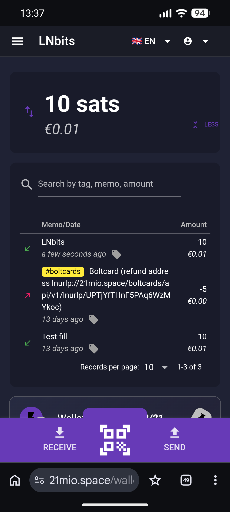
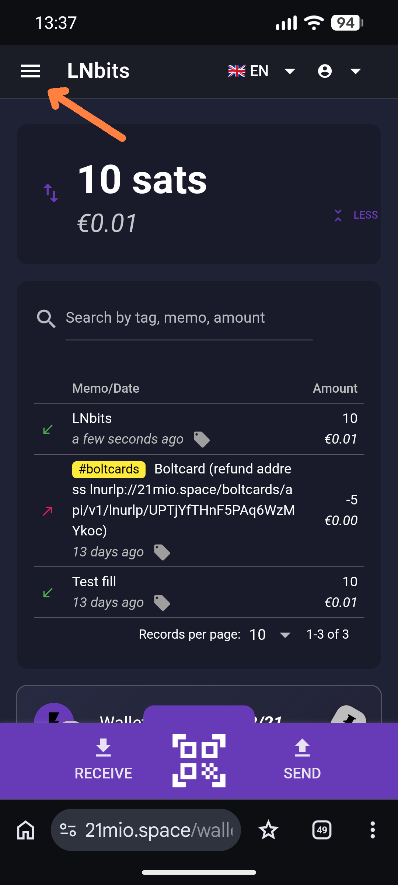
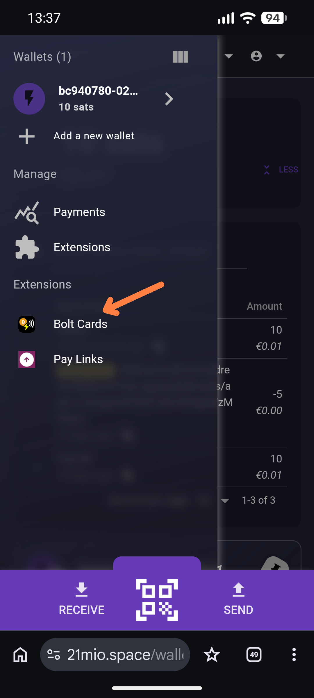
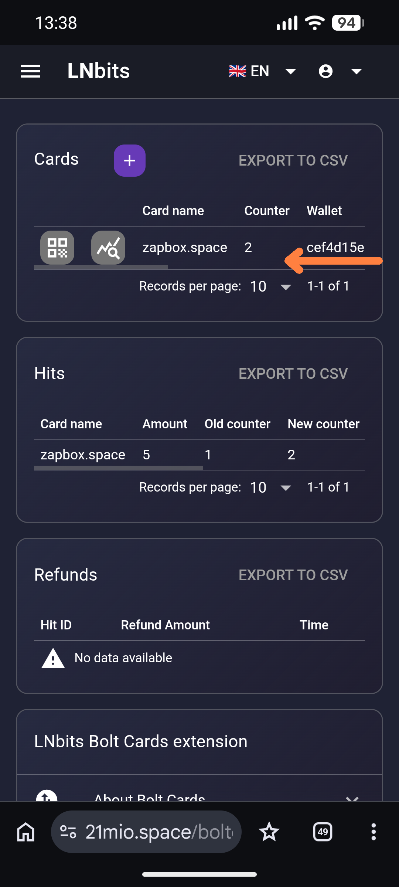
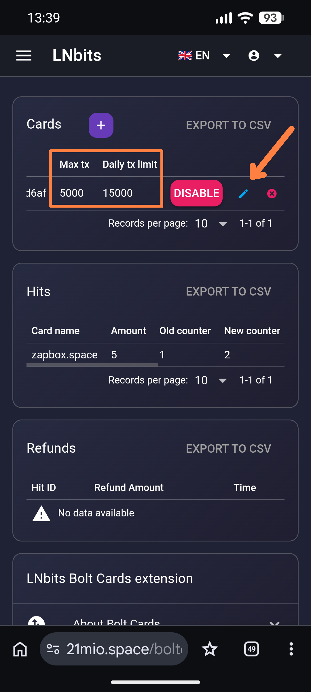
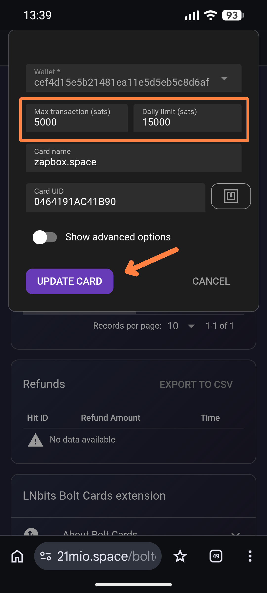

# Bolt Cards – Bitcoin ⚡ Lightning Wallet 

Die **Bolt Card** ist ein moderner NFC-Chip im Kartenformat. Sie enthält die Zugangsdaten zu einem Bitcoin-Wallet. Wenn du die Karte an ein Gerät oder ein Smartphone mit NFC-Funktion hältst, werden die Daten ausgelesen und Zahlungen autorisiert.

Es gibt leere Bolt Cards, die du selbst mit einem Lightning-Wallet verknüpfen musst. Und es gibt **vorinstallierte Bolt Cards** – für diese ist dieses Handout gedacht, um Nutzung, Einstellungen und Risiken zu verstehen.

> **Wichtige Hinweise:** 
> Die Bolt Card ist ein Service, die euch zur Verfügung gestellt wird. Ihr erhaltet eine Bolt Card und ein Bitcoin-Lightning-Web-Wallet. Im Hintergrund arbeitet ein LNbits-Server, der von jemandem betreut wird. In dem Moment, wenn ihr Einzahlungen auf das Wallet der Bolt Card transferiert, werden sie von jemandem verwahrt, da er den Server betreibt. Ihr müsst demjenigen also vertrauen, dass er euch die Bitcoin auch wieder zugänglich macht. Daher verwahrt nur soviel auf dem Wallet der Bolt Card, wie ihr im Nofall auch bereit seid zu spenden.

---

## Inhaltsverzeichnis

1. [Deine vorinstallierte Bolt Card](#deine-vorinstallierte-bolt-card)
2. [Das LNbits Wallet](#das-lnbits-wallet)
3. [Wallet befüllen – der Lightning-ATM](#wallet-befüllen--der-lightning-atm)
4. [Zahlen mit der Bolt Card an ZapBox-Automaten](#zahlen-mit-der-bolt-card-an-zapbox-automaten)
5. [Bolt Card Einstellungen](#bolt-card-einstellungen)
6. [Weiterführende Informationen](#weiterführende-informationen)

---

## Deine vorinstallierte Bolt Card

Auf der Vorderseite deiner Bolt Card findest du:

- **ZAPBOX.SPACE** – der Link zu einer Webseite, auf der die Technologie vorgestellt wird, die Bolt Cards verarbeiten kann.
- **Batch- und Seriennummer** – direkt darunter aufgedruckt. Jede Bolt Card ist einzigartig und kann anhand dieser Nummer identifiziert werden.
- **QR-Code** – der direkte Link zu deinem persönlichen Lightning-Wallet.

### QR-Code scannen und Wallet öffnen

Scanne den QR-Code mit deinem Smartphone. Er führt direkt zu einem Lightning-Wallet auf einem LNbits-Server, der deine Zahlungen verarbeitet.

> ⚠️ **Zwei wichtige Hinweise:**
>
> 1. **Speichere dir den Link** – z. B. in einer Notiz auf deinem Smartphone oder PC. So hast du jederzeit Zugriff auf dein Wallet, auch ohne die Bolt Card. Am PC-Monitor lässt sich das Wallet besonders komfortabel bedienen.
>
> 2. **Schütze den QR-Code** – Lass niemanden die Karte in die Hand nehmen oder den QR-Code scannen. Der QR-Code ist ein **offener Wallet-Zugang**: Wer Zugriff bekommt, kann alle Guthaben entwenden.

---

## Das LNbits Wallet

Nachdem du den QR-Code gescannt und das Wallet geöffnet hast, wirst du feststellen, dass die mobile Ansicht etwas kompakt ist – die grundlegende Bedienung ist aber recht einfach.

  

    
  

  

| Bereich | Funktion |
|---|---|
| **Oben – Betrag** | Zeigt das aktuelle Guthaben in Satoshis (sats). 100.000.000 sats = 1 Bitcoin. Ein leeres Wallet zeigt `10 sats`. |
| **Mitte – Transaktionen** | Grüner Pfeil = Eingang · Roter Pfeil = Ausgang (Zahlung) |
| **Unten – Aktionen** | `RECEIVE` zum Empfangen (Rechnung erstellen) · `SEND` zum Bezahlen · **QR-Code-Symbol** in der Mitte zum direkten Kamera-Scan |

### Navigation & Einstellungen

- **☰ Hamburger-Menü** (oben links, neben dem LNbits-Logo) – hier findest du Erweiterungen. Der Punkt **Bolt Cards** ist relevant, wenn du Einstellungen für die Karte vornehmen möchtest.
- **Oben rechts** – Sprache ändern und Account-Verwaltung. Wenn du mehrere Bolt Cards besitzt, musst du dich hier erst ausloggen, bevor du ein anderes Wallet öffnest. Im Browser kann immer nur ein Wallet gleichzeitig angemeldet sein – andernfalls erscheint ein **Fehler 404**. Lösung: aktuelles Wallet ausloggen, dann den neuen Link öffnen.
  

---

## Wallet befüllen – der Lightning-ATM

Bevor du die Bolt Card nutzen kannst, muss das Wallet mit Satoshis befüllt werden. Eine Möglichkeit dazu sind **kleine Lightning-ATMs**, die einen praktischen Einstieg in die Lightning-Technologie bieten. Der Ablauf:

1. Wirf z. B. 10 Cent in den ATM.
2. Nach Anzeige des Betrags den **LED-Taster** drücken, um die Abhebung zu bestätigen.
3. Öffne dein Bolt-Card-Wallet und tippe auf das **QR-Code-Symbol**, um die Kamera zu aktivieren.
4. Scanne den QR-Code des ATM und bestätige die Abhebung.
5. Kurz darauf erscheinen die Satoshis im Gegenwert der eingeworfenen Münzen in deinem Wallet.

> ℹ️ Der ATM arbeitet offline und bekommt die Abhebung nicht direkt mit. Da der LED-Taster danach blinkt, drücke ihn einmal, um den ATM für die nächste Person freizugeben.

---

## Zahlen mit der Bolt Card an ZapBox-Automaten

ZapBox-Automaten verfügen über ein **NFC-Modul**, erkennbar am **))** Symbol. Einige Automaten haben zusätzlich ein Display und zeigen einen QR-Code an.

### Zahlung per Bolt Card (NFC) – der einfachste Weg

1. Prüfe, ob das Gerät aktiv ist: Ein QR-Code wird angezeigt, oder eine LED leuchtet dauerhaft.
2. Halte die **Bolt Card** für mindestens zwei Sekunden an das NFC-Modul.
3. Das Display zeigt **PENDING NFC**, oder eine LED blinkt. Im Hintergrund wird die Zahlung vorbereitet.
4. Nach erfolgreicher Zahlung erscheint der **ACTION-Screen** bzw. die **ACT-LED** blinkt – das Produkt wird ausgegeben.

### Zahlung per QR-Code (alternativ)

Der klassische Weg, eine Lightning-Rechnung zu bezahlen, ist das **Scannen des QR-Codes** am Automaten:

1. Öffne dein Wallet und tippe auf das QR-Code-Symbol in der Mitte.
2. Erlaube den Kamera-Zugriff, wenn du dazu aufgefordert wirst.
3. Richte die Kamera auf den QR-Code des Automaten.
4. Bestätige die Zahlung – fertig.

## Bolt Card Einstellungen

Die Bolt Card hat mehrere Schutzmechanismen. Es gibt ein Limit pro Transaktion und ein Tageslimit. Voreingestellt ist 5000 Satoshi pro Transaktion und 15000 Satoshi pro Tag. Diese Werte können individuell angepasst werden. 

  
  
  
  
  

1. Wählt oben links das Hamburger-Symbol (☰) für das Menü
2. Wählt **Bolt Cards**
3. Wischt die Zeile mit zapbox.space nach links, um zum Bearbeitungsbereich zu gelangen
4. Klickt auf den kleinen **blauen Stift** (Edit-Icon)
5. Bearbeitet **Max transaction** und/oder **Daily limit** und bestätigt mit **UPDATE CARD**

In dem Bereich könnt ihr die Karte auch auf **DISABLE** setzen und sie später wieder auf **ENABLE** aktivieren.

## Weiterführende Informationen

Weitere Informationen zur Bolt Card und generelle Informationen zu Bitcoin und Lightning findet ihr auf [ereignishorizont.xyz](https://ereignishorizont.xyz/boltcard/).

| Ressource | Link |
|---|---|
| Bolt Cards einrichten | https://ereignishorizont.xyz/boltcard/ |
| ereignishorizont.xyz - Onboarding | https://ereignishorizont.xyz/onboarding/|
| ZapBox - Bitcoin ⚡Lightning Schalter | https://zapbox.space/ |
| LNbits - Wallet und Account System | https://lnbits.com/ |

---

*Mit freudlicher Empfehlung von **[zapbox.space](https://zapbox.space)*** - Version: bch945441 | Sprache: Deutsch
