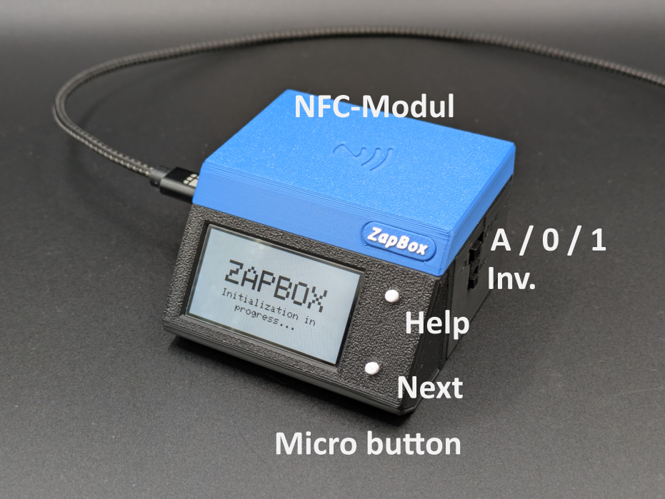
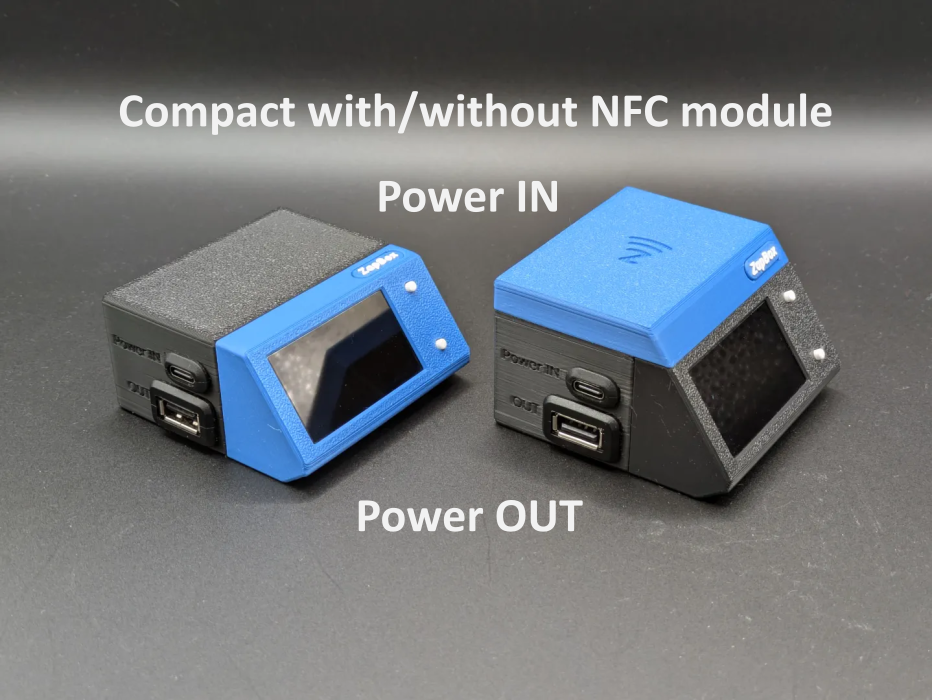

# ZapBox Compact – Bedienungsanleitung

**Sprache:** Deutsch | **Version:** oi940284

---

## Inhaltsverzeichnis

1. [Übersicht](#übersicht)
2. [Ansichten](#ansichten)
3. [Anschlüsse](#anschlüsse)
4. [Bedienelemente](#bedienelemente)
5. [Einrichtung und Inbetriebnahme](#einrichtung-und-inbetriebnahme)
6. [Option: NFC-Modul](#option-nfc-modul)
7. [Technische Daten](#technische-daten)
8. [Sicherheitshinweise](#sicherheitshinweise)
9. [Weiterführende Links](#weiterführende-links)

---

## Übersicht

Die **ZapBox Compact** ist ein elektronischer Schalter für Bitcoin-Lightning-Zahlungen. Mit einer Zahlung über das Lightning-Netzwerk lässt sich ein Ausgang schalten – ideal für Automaten, Präsentationen, Eventsteuerung und viele weitere Anwendungen.

### Grundausstattung

| Komponente | Beschreibung |
|---|---|
| Mikrocontroller | T-Display-S3 mit 1,9" LCD-Display |
| Frontpanel | Wahlweise mit 35° oder 90° Display Front (90° auch zum Einbau erhältlich) |
| Eingang | USB-C (Power IN) |
| Ausgang | USB-A Buchse |
| Bedienelement | Zwei On-board-Mikrotaster |
| Schalter 1 | 3-poliger Schiebeschalter (AUTO / OFF / ON) |
| Schalter 2 | 2-poliger Schiebeschalter (Invert Output) |
| Option BTC-Ticker | Aktivierbar über den Web Installer |
| Option NFC-Modul | Für Bolt Cards (NTAG424 DNA) und Standard NTAG213/215/216 (mit LNURL-withdraw) |

---

## Ansichten

*Bild 1: Frontansicht*

*Bild 2: Rückansicht*

---

## Anschlüsse

### Eingang - USB-C Buchse zur Spannungsversorgung (5V)

Versorgen Sie das Gerät über den Anschluss **Power IN** mit einem USB-C-Kabel mit **5 V DC (max. 5 A)**.

> **Hinweis:** Der Power-IN-Anschluss ist nicht „intelligent". Einige Ladegeräte oder Powermodule mit USB-C-Ausgang erkennen die ZapBox nicht und liefern keinen Strom. Verwenden Sie in diesem Fall einen **USB-A-Ausgang** der Spannungsversorgung oder eine andere Stromquelle.

---

### Eingang - USB-C Buchse am Mikrocontroller (Datenzugang, hinter rechtem Seitenpanel)

Um Daten vom Gerät zu lesen oder zu übertragen, verbinden Sie die ZapBox mit einem Computer oder Laptop:

1. An der **rechten Seite der Frontblende** befindet sich eine kleine, verdeckte Klappe.
2. Öffnen Sie die Klappe, indem Sie von unten mit einem **schmalen Schraubendreher** die Klappe nach rechts wegschieben.
3. Schließen Sie ein USB-C-Kabel am darunter liegenden Anschluss des Mikrocontrollers an.

*Bild: Panel öffnen und USB-C-Anschluss für Daten*

> **Wichtiger Hinweis:** Der USB-Anschluss direkt am Mikrocontroller ist ausschließlich zum Flashen der Firmware und zur Übertragung von Konfigurationsparametern vorgesehen. Während des Flashvorgangs darf keine Last am Ausgang angeschlossen oder geschaltet werden, da dies zu Fehlfunktionen oder zur **Beschädigung des Mikrocontrollers** führen kann.
>
> Es wird daher empfohlen:
> - während der USB-Verbindung keine Last am Ausgang anzuschließen, oder
> - den regulären **Power-IN-Eingang** zusätzlich an dieselbe Spannungsversorgung anzuschließen. Dadurch wird sichergestellt, dass der Strom für das Leistungsrelais nicht über den Mikrocontroller fließt und diesen überlastet.

---

### Ausgang - USB-A-Buchse (geschaltete 5V Spannung)

Die USB-Buchse wird über einen Relais-Schaltkontakt geschaltet. Die **Gesamtbelastung** der Buchsen sollte **3 A nicht überschreiten**.

---

## Bedienelemente

Die ZapBox verfügt über zwei kleine **On-board-Mikrotaster**, die direkt mit dem Mikrocontroller verbunden sind. Alle Funktionen sind über die Mikrotaster erreichbar. Zusätzlich hat die ZapBox an der Unterseite des Frontpanels einen Reset Taster und an der Seite zwei Schiebeschalter.

### Funktionsübersicht - Mikrotaster

| Funktion | Mikrotaster |
|---|---|
| Hilfe-Seite anzeigen | 1× HELP drücken | 
| Nächste Seite / Produktwechsel | 1× NEXT drücken |
| REPORT-Seite anzeigen | 2× HELP drücken | 
| Config-Modus aufrufen | NEXT mind. 5 Sek. gedrückt halten |

### Funktionsübersicht - Schiebeschalter

Die ZapBox Compact verfügt über zwei Schiebeschalter.

#### Schalter 1 – Dreifach-Schiebeschalter (AUTO / OFF / ON)

| Stellung | Funktion |
|---|---|
| **A** (AUTO) | Automatikbetrieb – Normalbetrieb |
| **0** (OFF) | Spannungsversorgung unterbrochen – Ausgang AUS |
| **1** (ON) | Ausgang dauerhaft EIN (Bei Schalter 2 - Inverse = AUS) |

#### Schalter 2 – Zweifach-Schiebeschalter (standard / invertiert)

| Stellung | Funktion |
|---|---|
| **Std.** (Standard) | Der Ausgang ist Ruhezustand spannungslos (0 V). Nach dem Schaltvorgang liegt 5 V an den USB-Buchsen an. |
| **Inv.** (Inverse) | Der Ausgang liegt im Ruhezustand auf 5 V. Nach dem Schaltvorgang wechselt der Ausgang auf 0 V (inverses Schalten). |

> **Hinweis:** Befindet sich der Zweifach-Schalter auf **Inv.** und der Dreifach-Schalter auf **Stellung 1**, ist der Ausgang – anders als im Normalbetrieb – **AUS** statt EIN.

---

## Einrichtung und Inbetriebnahme

Die ZapBox wird nach der Fertigung getestet und mit der aktuellen Firmware ausgeliefert - sie ist aber nicht parametriert. Die Software wird aktiv weiterentwickelt, daher ist es empfehlenswert, die ZapBox gleich zu Beginn einmal mit der neuesten Firmware zu bespielen und dann eine Parametrierung durchzuführen. Dafür gibt es einen komfortablen **Web-Installer**.

Hier eine Schritt-für-Schritt-Anleitung für die Einrichtung:

1. Öffnet das rechte Seitenpanel der Frontblende, wie oben unter "Eingang - USB-C Buchse am Mikrocontroller" beschrieben.
2. Schließt die ZapBox an dem USB-C-Port mit einem Kabel an und verbindet es mit einem Computer. 
3. Öffnet einen Chromium Browser, zum Beispiel Google Chrome, Microsoft Edge, Brave, Vivaldi, Opera oder [Helium](https://helium.computer/).
4. Ruft die Web-Installer Seite **https://installer.zapbox.space/** auf.
5. Flasht die aktuellste "Latest" Version, wie unter Punkt 1 des Web-Installer beschrieben.
6. Nach dem Flashvorgang schließt das kleine Fenster und geht zu Punkt 3 - Load config values. Dort wählt ihr den Button `🔌 Connect`.
7. Jetzt solltet ihr in dem grünen Feld `✅ Connected` und `✅ Config mode` sehen, vorausgesetzt die ZapBox befindet sich jetzt auch im `SERIAL CONFIG MODE`. Das Display müsste es euch anzeigen. Falls nicht, prüft einmal den Punkt 2 - Prepare connection.
8. Drei Parameter benötigt die ZapBox: `WiFi SSID` / `WiFi password` / `Device settings string`. Den Device-Settings-String bekommt ihr von eurer LNbits Wallet. Fügt dazu die Erweiterung **Bitcoin Switch** oder **ZapBox** hinzu. Die ZapBox Erweiterung unterstützt auch das NFC-Modul, ansonsten sind sie identisch.
9. Nachdem alle drei Parameter hinterlegt wurden, müssen dies mit dem Button `🔥 Write Config` einmal gespeichert werden und die ZapBox mit dem Button `🔁 Restart` neu gestartet werden.

Das sollte es auch schon gewesen sein. Die ZapBox wird nach der Initialisierung den QR-Code des Produkts anzeigen und ist bereit für die erste Zahlung und anschließender Aktion am USB-Ausgang. 

Bei Fehler oder Störungen, bitte auf der Web Installer Seite, weiter unten die Kapitel "Error Detection & Report" und "Troubleshoot" beachten. 

---

## Option: NFC-Modul

Je nach Ausstattung ist auf der **Oberseite der ZapBox** ein NFC-Modul verbaut. Alternativ ist das Modul auch separat erhältlich. Die ZapBox unterstützt aktuell folgende Kartentypen:

- **Boltcards** (NTAG424)
- **LNURL-Withdraw** von NTAG21x (213 / 215 / 216)

Voraussetzung für die Funktion ist die LNbits [ZapBox Extension](https://github.com/AxelHamburch/zapbox_extension). Sie muss von dem LNbits Server unterstützt werden. 

---

## Technische Daten

| Eigenschaft | Wert |
|---|---|
| Versorgungsspannung | 5 V DC über USB-C |
| Maximaler Eingangsstrom | 5,0 A |
| Ausgangsleistung | max. 3,0 A (empfohlen) |
| Display | 1,9" LCD (T-Display-S3) |
| Kommunikation | Wi-Fi (ESP32-S3) |
| Zahlungsprotokoll | Bitcoin Lightning Network |

---

## Sicherheitshinweise

- Betreiben Sie das Gerät ausschließlich mit der angegebenen Versorgungsspannung.
- Überschreiten Sie nicht die maximalen Strombelastungen der Ausgänge.
- Führen Sie keine Arbeiten an den Relaiskontakten unter Last durch.
- Das Gerät ist nicht für den Einsatz in feuchten oder nassen Umgebungen geeignet.
- Außerhalb der Reichweite von Kindern aufbewahren.

---

## Weiterführende Links

| Ressource | Link |
|---|---|
| Übersicht aller ZapBox-Modelle | https://zapbox.space/ |
| Web-Installer, Kurzübersicht & Fehlerbehebung | https://installer.zapbox.space/ |
| Detaillierte Dokumentation (Parameter & Funktionen) | https://ereignishorizont.xyz/zapbox/ |
| GitHub-Repository (Software, E-Layouts, 3D-Druckdateien, Bedienungsanleitungen) | https://github.com/AxelHamburch/ZapBox |
| ZapBox Extension | https://github.com/AxelHamburch/zapbox_extension |
| LNbits | https://lnbits.com/ |

---

*Änderungen und Irrtümer vorbehalten. Stand: 2026*
