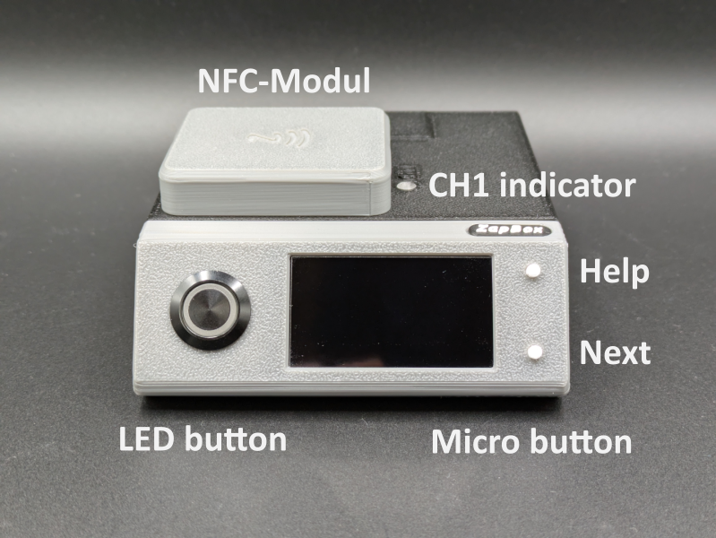
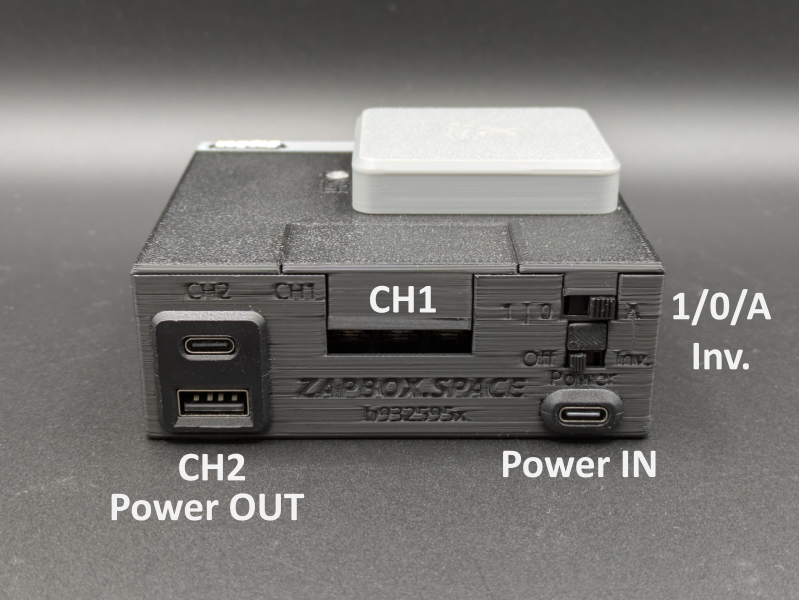

# ZapBox Duo – Operating Instructions

**Language:** English | **Version:** OI939600

---

## Overview

The **ZapBox Duo** is an electronic switch for Bitcoin Lightning payments. A payment over the Lightning Network triggers two independent outputs – ideal for vending machines, presentations, event control, and many other applications.

### Standard Equipment

| Component | Description |
|---|---|
| Microcontroller | T-Display-S3 with 1.9" LCD display |
| Front panel | Optional 35° or 90° angle |
| Input | USB-C (Power IN) |
| Output Channel 1 (CH1) | 30 A power relay with external terminals |
| Output Channel 2 (CH2) | Dual socket with USB-A and USB-C |
| Control element | LED button (full ZapBox operability) |
| Switch 1 | 3-position slide switch (AUTO / OFF / ON) |
| Switch 2 | 2-position slide switch (Invert Output) |
| BTC ticker | Optional |
| Board buttons | 2 on-board micro buttons (optional) |
| NFC module | For Boltcards (optional) |

---

## Views

**Image 1: Front view**

**Image 2: Rear view**

---

## Getting Started

### Power Supply

Connect the device to a power source via USB-C cable at the **Power IN** port with **5 V DC (max. 5 A)**.

> **Note:** The Power IN port is not "intelligent". Some chargers or power modules with a USB-C output do not recognise the ZapBox and will not supply power. In this case, use a **USB-A output** of your power supply or a different power source.

### First Test (pre-configured device)

If the device is already configured, you can run a quick first test:

1. Press the **LED button** to cycle through the display screens.
2. Scan the displayed **QR code** with a Lightning wallet.
3. Pay the invoice.
4. You should hear the relay click – the switching operation was successful.

---

## Setup

### Web Installer

For initial setup and firmware updates, use the **Web Installer**:

**https://installer.zapbox.space/**

The full setup process is described there. It is recommended to always flash the **"Latest" firmware** version to keep the ZapBox up to date.

### USB Data Access (hidden panel)

To read data from or transfer data to the device, connect the ZapBox to a computer or laptop:

1. On the **right side of the front panel** there is a small hidden flap.
2. Open the flap by pushing it to the right with a **thin flat-head screwdriver** inserted from below.
3. Connect a USB-C cable to the microcontroller port behind the flap.

**Image: Opening the panel and USB-C data port**

> **Important:** The USB port on the microcontroller is exclusively intended for flashing new firmware or transferring configuration parameters. If switching functions are triggered simultaneously during flashing, this can cause **malfunctions or damage to the microcontroller**.
>
> It is therefore strongly recommended to either:
> - Avoid triggering any switching functions while flashing, **or**
> - additionally connect the regular **Power IN** port to the same power supply, so that current for the power relay does not flow through the microcontroller and overload it.

---

## Slide Switches

The ZapBox Duo has two slide switches.

### Switch 1 – 3-Position Slide Switch (AUTO / OFF / ON)

| Position | Function |
|---|---|
| **A** (AUTO) | Automatic mode – normal operation |
| **0** (OFF) | Power supply disconnected – output OFF |
| **1** (ON) | Output CH2 (dual USB A/C) permanently ON |

### Switch 2 – 2-Position Slide Switch (Invert / Normal)

| Position | Function |
|---|---|
| **Normal** | CH2 is de-energised (0 V) at rest. After switching, 5 V is present at the USB sockets. |
| **Inv.** (Invert) | CH2 is at 5 V at rest. After switching, the output changes to 0 V (inverse switching). |

> **Note:** If the 2-position switch is set to **Inv.** and the 3-position switch is set to **position 1**, the output is **OFF** – contrary to normal operation where it would be ON.

---

## Outputs

### Channel 1 (CH1) – 30 A Power Relay

The power relay on Channel 1 exposes the contacts **COM / NO / NC** on the outside. These are factory-covered with a **protective cap**.

- **Removing the cap:** Simply pull it upward.
- **Replacing the cap:** Place the long side first, then press the short angled side downward until the cap snaps into place.

The power relay contacts are rated for a **maximum current of 30 A**.

On the **top of the ZapBox** there is a small transparent opening. An LED behind it indicates the **ON status of the power relay**.

### Channel 2 (CH2) – Dual USB Socket (USB-A / USB-C)

The dual USB socket is switched via a relay switching contact (CH2). The **total load** on the sockets should **not exceed 3 A**.

---

## NFC Module (optional)

Depending on the configuration, an NFC module is mounted on the **top of the ZapBox**. It supports the following card types:

- **Boltcards** (NTAG424)
- **LNURL-Withdraw** from NTAG21x (213 / 215 / 216)

---

## Controls

Depending on the version, the ZapBox is equipped with two small **on-board micro buttons** in addition to the LED button, connected directly to the microcontroller. All functions can be accessed via both the LED button and the micro buttons.

### Function Overview

| Function | Micro button | LED button |
|---|---|---|
| Show Help page | Press HELP 1× | Hold LED button for at least 2 sec. |
| Next page / product change | Press NEXT 1× | Press LED button 1× briefly |
| Show REPORT page | Press HELP 2× | Press LED button 3× in quick succession |
| Enter Config mode | Hold NEXT for at least 5 sec. | Press 1× briefly, then hold for at least 5 sec. |

---

## Technical Specifications

| Property | Value |
|---|---|
| Supply voltage | 5 V DC via USB-C |
| Maximum input current | 5 A |
| CH1 switching capacity | max. 30 A |
| CH2 output capacity | max. 3 A (total) |
| Display | 1.9" LCD (T-Display-S3) |
| Communication | Wi-Fi (ESP32-S3) |
| Payment protocol | Bitcoin Lightning Network |

---

## Safety Instructions

- Only operate the device with the specified supply voltage.
- Do not exceed the maximum current ratings of the outputs.
- Do not perform any work on the relay contacts under load.
- The device is not suitable for use in humid or wet environments.
- Keep out of reach of children.

---

## Further Resources

| Resource | Link |
|---|---|
| Overview of all ZapBox models | https://zapbox.space/ |
| Web Installer, quick reference & troubleshooting | https://installer.zapbox.space/ |
| Detailed documentation (parameters & functions) | https://ereignishorizont.xyz/zapbox/ |
| GitHub repository (software, PCB layouts, 3D print files) | https://github.com/AxelHamburch/ZapBox |

---

*Subject to change without notice. As of 2026*
