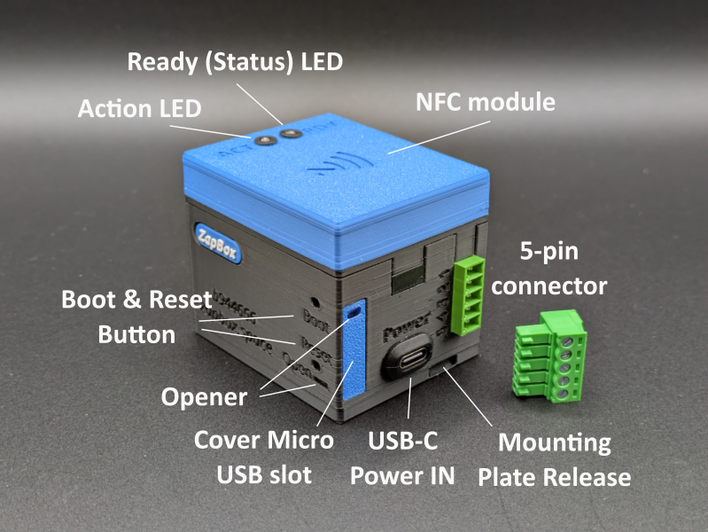
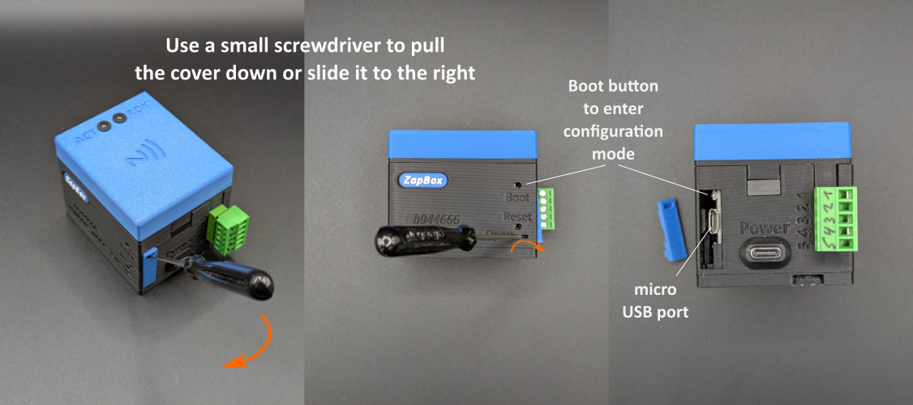
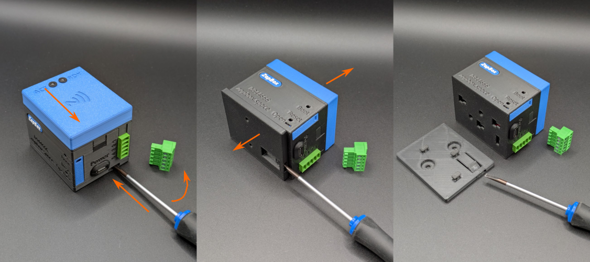

# ZapBox Headless Servo – User Manual

**Language:** English | **Version:** oi944935

---

## Table of Contents

1. [Overview](#overview)
2. [Views](#views)
3. [Connections](#connections)
4. [Operating Elements](#operating-elements)
5. [Setup and Commissioning](#setup-and-commissioning)
6. [Configuration](#configuration)
7. [NFC Module (Optional)](#nfc-module-optional)
8. [Technical Specifications](#technical-specifications)
9. [Safety Notes](#safety-notes)
10. [Further Resources](#further-resources)

---

## Overview

The **ZapBox Headless** is an electronic switch for Bitcoin Lightning payments without a display. With a payment via the Lightning Network, an output can be switched – ideal for embedded applications, hidden installations, machinery and anywhere a display is not needed.

The ZapBox Headless Servo features a connector for connecting external relays with 5 V control as well as digital servo motors. Both 180° servo motors for positioning tasks and 360° servo motors for continuous rotation applications are supported.
Additionally, the connector provides two universal connections for actuators and sensors. Configuration and parametrization are performed via the Web Installer.

The device status is indicated exclusively via a **Status LED**. A second **Action LED** indicates the switching function.

### Standard Features

| Component | Description |
|---|---|
| Microcontroller | ESP32 Dev Module (no display) |
| Input | USB-C (Power IN) |
| Output | 5-pin connector (15EDG 3.81 mm) |
| Status Indicator | Status LED with blink patterns and Action LED feedback |
| Operating Element | Micro pushbuttons for BOOT (Config Mode) and Reset |
| Optional NFC Module | For Bolt Cards (NTAG424 DNA) and Standard NTAG213/215/216 (with LNURL-withdraw) |

---

## Views

*Figure 1: Front view / Top view*

---

## Connections

### Input - USB-C Socket for Power Supply (5V)

Power the device via the **Power IN** connection with a USB-C cable at **5 V DC (max. 5 A)**.

> **Note:** The Power-IN port is not "intelligent". Some chargers or power modules with USB-C output may not recognize the ZapBox and will not supply power. In this case, use a **USB-A output** from your power supply or another power source.

---

### Input - Micro-USB Socket on Microcontroller (Data Access, Front)

To read or transfer data from the device, connect the ZapBox to a computer or laptop:

1. On the **front left side** there is a small panel next to the USB connectors. Open the panel by pushing it to the right from below with a **narrow screwdriver**.
2. Connect a Micro-USB cable to the microcontroller.

*Figure 2: Open panel for data connection with Micro USB port*

> **Important Note:** The USB port directly on the microcontroller is intended exclusively for flashing the firmware and transferring configuration parameters. During the flashing process, no load may be connected to or switched at the output, as this can cause malfunctions or **damage to the microcontroller**.
>
> Therefore, it is recommended:
> - not to connect or switch any load at the output during USB connection, or
> - to additionally connect the regular **Power-IN input** to the same power supply. This ensures that the current for the power relay does not flow through the microcontroller and overload it.

---

### Output - 5-pin Connector

**Terminal Assignment:**
| Pin | Function | Connection Option | Application |
|------|----------|-----------|---------------|
| 1 | 5V | Output (Input possible) | Power supply for servo, etc. |
| 2 | GND | Output (Input possible) | Ground connection for servo, etc. |
| 3 | Relay or Servo Motor | Output | 3.3V servo or relay control signal |
| 4 | Sensor / Actuator 1 | Input or Output | Sensor or Actuator 1 |
| 5 | Sensor / Actuator 2 | Input or Output | Sensor or Actuator 2 |

The ZapBox can be powered either via the USB-C connector with 5 V power supply or via terminals 1 and 2.
Optional functions are available for terminals 3 to 5, which must be set and parametrized via the Web Installer. Further information can be found under "Optional Settings and Functions – ZapBox Mode" or "Special Features for Vending Machines" in the Web Installer.
By default, the output for terminal 3 is set to "Relay", while terminals 4 and 5 are set to "No function".

---

## Operating Elements

The ZapBox Headless has **no display**. The device status is indicated exclusively via the **Status LED** (GPIO 21 (external) / GPIO 2 (onboard)) and **Action LED** (GPIO 13).

### Status LED – Blink Patterns

| Pattern | Meaning |
|---|---|
| 3× short flash on startup | Boot completed |
| Rapid flashing | Connection / Initialization |
| Slow flashing (1 Hz) | Config mode active |
| Steady light | Ready for operation, waiting for payment |
| Brief shut off (300 ms) | Action started – relay/servo triggered |
| 200 ms on / 800 ms off | NFC payment pending (PENDING) |
| 2× short flash | Payment successful |
| 3× short flash | NFC timeout / Error |
| 1× flash (500 ms on/off, 2 s pause) | Error pattern 1: No WiFi |
| 2× flash (300 ms on/off, 2 s pause) | Error pattern 2: No Internet |
| 3× flash (250 ms on/off, 2 s pause) | Error pattern 3: Server unreachable |
| 4× flash (200 ms on/off, 2 s pause) | Error pattern 4: WebSocket connection failed |

### Operating Buttons

| Function | Button |
|---|---|
| Enter Config Mode | Hold BOOT button for at least 5 sec. |
| Restart | Reset button |

### Mounting Bracket with Snap Lock

*Figure 3: Release mounting bracket of a Headless with NFC module*

> **Note:** The ZapBox is only pushed onto the mounting bracket and locked with a snap lock. The lock can be released with a flat screwdriver. To do this, carefully insert the screwdriver into the slot, lift slightly and press the upper part of the ZapBox in the direction of the screwdriver. The connection should release and the ZapBox can be separated from the mounting plate by lifting.

---

## Setup and Commissioning

The ZapBox is tested after manufacturing and shipped with the current firmware - but it is not parametrized. The software is actively developed, so it is recommended to use the latest firmware on the ZapBox from the beginning and then perform parametrization. For this, there is a convenient **Web Installer** (Headless version).

Here is a step-by-step guide for setup:

1. Connect the ZapBox to the Micro-USB port of the microcontroller with a cable and connect it to a computer.
2. Open a Chromium browser, for example Google Chrome, Microsoft Edge, Brave, Vivaldi, Opera or [Helium](https://helium.computer/).
3. Visit the Web Installer page **https://installer.zapbox.space/headless/**.
4. Flash the latest "Latest" version (Headless), as described in step 1 of the Web Installer.
5. After flashing, close the small window and go to step 3 - Load config values. There click the `🔌 Connect` button.
6. You should now see `✅ Connected` and `✅ Config mode` in the green field. Config mode is active as soon as the **Status LED blinks slowly** (approx. 1 Hz). If not, check step 2 - Prepare connection.
7. The ZapBox requires three parameters: `WiFi SSID` / `WiFi password` / `Device settings string`. You get the Device-Settings-String from your LNbits Wallet. Add the **Bitcoin Switch** or **ZapBox** extension. The ZapBox extension also supports the NFC module, otherwise they are identical.
8. After all three parameters have been entered, save them with the `🔥 Write Config` button and restart the ZapBox with the `🔁 Restart` button.

After initialization, the Status LED lights up continuously – the ZapBox is ready for operation and waiting for the first payment.

For errors or malfunctions, please refer to the "Error Detection & Report" and "Troubleshoot" sections further down on the Web Installer page.

---

## Configuration

The ZapBox Headless Servo assumes the default value **"Relay"** for terminal 3 after initial installation. Since the ZapBox has no built-in relay, you can control an external **5 V relay (high-level trigger)**.

### Configuration Steps

The prerequisite for parametrization is that the Web Installer is `✅ Connected` to the ESP32 and the ZapBox is in `✅ Config mode` (as described under **Setup and Commissioning**, step 5). Then proceed as follows:

1. **Read Configuration:** Click `📖 Read Config`
2. **Adjust Parameters:** Change the desired values (see sections below)
3. **Save and Restart:** Click `🔥 Write Config` and restart with `🔁 Restart`

### Servo Control (Terminal 3)

For servo motors, you must select a servo type in the Web Installer under **Optional settings and functions - ZapBox Mode**:

- **180° Servo**
- **360° Servo** (continuous)

After selecting a servo type, additional parameter fields appear for configuring the servo type.

### Universal Inputs/Outputs (GPIO)

The ZapBox has two universally configurable **GPIOs** (General Purpose Input/Output):

| Pin | Function | Description |
|--------|----------|-------------|
| 4 | Sensor / Actuator 1 | Input or Output, freely configurable |
| 5 | Sensor / Actuator 2 | Input or Output, freely configurable |

Further information on configuration can be found in the section **Special features for vending machines**.

> **Important:** All servo motors and sensors/actuators **must be powered by 5 V**. The ZapBox provides 5 V at terminal 1.

---

## NFC Module (Optional)

Depending on the configuration, an NFC module is installed on the **top of the ZapBox**. Alternatively, the module is also available separately. The ZapBox currently supports the following card types:

- **Boltcards** (NTAG424)
- **LNURL-Withdraw** from NTAG21x (213 / 215 / 216)

The prerequisite for the function is the LNbits [ZapBox Extension](https://github.com/AxelHamburch/zapbox_extension). It must be supported by the LNbits server.

---

## Technical Specifications

| Property | Value |
|---|---|
| Supply Voltage | 5 V DC via USB-C |
| Maximum Input Current | 3.0 A |
| Output Performance | max. 3.0 A |
| Microcontroller | ESP32 Dev Module (WROOM-32) |
| Flash Memory | 4 MB |
| SRAM | 512 KB |
| Display | none (Headless) |
| Status Indicator | Status LED / Action LED |
| Communication | Wi-Fi (ESP32) |
| I/O Ports | max. 3 - 1 Servo (or Relay), 2 Sensors/Actuators |
| Payment Protocol | Bitcoin Lightning Network |

---

## Safety Notes

- Operate the device exclusively with the specified supply voltage.
- Servo motors draw high currents and can overload the power supply.
- Do not activate the servo or an actuator if the ESP32 is only connected via the Micro-USB port.
- The device is not suitable for use in damp or wet environments.
- Keep out of reach of children.

---

## Further Resources

| Resource | Link |
|---|---|
| Overview of all ZapBox models | https://zapbox.space/ |
| Web Installer, Quick Reference & Troubleshooting | https://installer.zapbox.space/headless/ |
| Detailed Documentation (Parameters & Functions) | https://ereignishorizont.xyz/zapbox/ |
| GitHub Repository (Software, E-Layouts, 3D Print Files, User Manuals) | https://github.com/AxelHamburch/ZapBox |
| ZapBox Extension | https://github.com/AxelHamburch/zapbox_extension |
| LNbits | https://lnbits.com/ |

---

*Subject to change and errors. Status: 2026*
