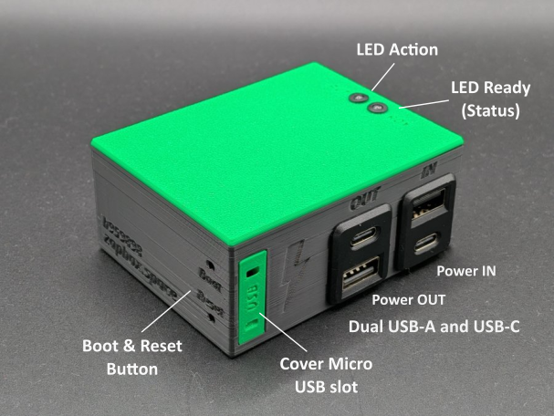
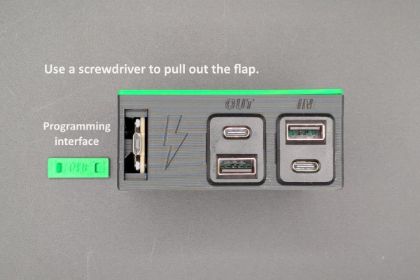

# ZapBox Headless Simple – Operating Instructions

**Language:** English | **Version:** oi967253
---
## Table of Contents

1. [Overview](#overview)
2. [Views](#views)
3. [Connections](#connections)
4. [Controls](#controls)
5. [Setup and Commissioning](#setup-and-commissioning)
6. [Technical Data](#technical-data)
7. [Safety Instructions](#safety-instructions)
8. [Further Links](#further-links)

---

## Overview

The **ZapBox Headless Simple** is an electronic switch for Bitcoin Lightning payments without a display. A payment via the Lightning Network can be used to switch an output – ideal for embedded applications, concealed installations, machine building, and anywhere a display is not needed.

The operating state is indicated exclusively via a **status LED**. A second **action LED** indicates the switching function.

### Basic Equipment

| Component | Description |
|---|---|
| Microcontroller | ESP32 Dev Module (no display) |
| Input | Dual USB-A and USB-C |
| Output | Dual USB-A and USB-C |
| Status display | Status LED with blink patterns and action LED as feedback |
| Control | Micro switch for BOOT (config mode) and reset |

## Views

*Figure 1: Three-side view*

---

## Connections

### Input - Dual USB-A and USB-C socket for power supply (5V)

Power the device via the **Power IN** connector using a USB-C cable with **5 V DC (max. 5 A)**.

> **Note:** The USB power connector does not support automatic USB-C power negotiation (no USB-C Power Delivery). Some USB-C chargers or power modules therefore do not recognize the ZapBox as a load and will not supply power. In this case, use a **USB-A output** of the power supply or an alternative 5 V power source. The maximum current must not exceed 3 A.

### Input - Micro-USB socket on the microcontroller (data access, on the side)

To read or transfer data from the device, connect the ZapBox to a computer or laptop:

1. On the **right side**, next to the USB connectors, there is a small panel. Open the panel with a **narrow screwdriver** by carefully prying it out.
2. Connect a Micro-USB cable to the microcontroller.

*Figure 2: Micro USB Port*

> **Important note:** The USB connector directly on the microcontroller is intended exclusively for flashing the firmware and transferring configuration parameters. During the flashing process, no load may be connected or switched at the output, as this can lead to malfunctions or **damage to the microcontroller**.
>
> It is therefore recommended to either:
> - not connect any load at the output while the USB connection is active, or
> - additionally connect the regular **Power-IN input** to the same power supply. This ensures that the current for the power relay does not flow through the microcontroller and overload it.

### Output - Dual USB-A and USB-C socket (switched 5V voltage)

The USB sockets are switched via a relay contact. The **total load** of the sockets should **not exceed 3 A**.

---

## Controls

The ZapBox Headless has **no display**. The operating state is signaled exclusively via the **status LED** (GPIO 21 (external) / GPIO 2 (onboard)) and **action LED** (GPIO 13).

### Status LED – Blink Patterns

| Pattern | Meaning |
|---|---|
| 3× short blink on start | Boot complete |
| Fast blinking | Connecting / initializing |
| Slow blinking (1 Hz) | Config mode active |
| Steady light | Ready for operation, waiting for payment |
| Short off (300 ms) | Action started – relay/servo triggered |
| 200 ms on / 800 ms off | NFC payment pending (PENDING) |
| 2× short blink | Payment successful |
| 3× short blink | NFC timeout / error |
| 1× blink (500 ms on/off, 2 s pause) | Error pattern 1: No WiFi |
| 2× blink (300 ms on/off, 2 s pause) | Error pattern 2: No internet |
| 3× blink (250 ms on/off, 2 s pause) | Error pattern 3: Server unreachable |
| 4× blink (200 ms on/off, 2 s pause) | Error pattern 4: WebSocket connection failed |

### Control Buttons

| Function | Button |
|---|---|
| Open config mode | Hold BOOT button for at least 5 sec. |
| Restart | Reset button |

---

## Setup and Commissioning

The ZapBox is tested after manufacturing and shipped with the current firmware - however, it is not yet parameterized. The software is under active development, so it is recommended to flash the ZapBox with the latest firmware right at the start and then perform the parameterization. A convenient [**Web Installer Headless**](https://installer.zapbox.space/headless/) is available for this.

### Step 1: Firmware Update
1. Open the panel on the right side, as described above under "Input - Micro-USB socket on the microcontroller".
2. Connect the ZapBox to the USB-C port with a cable and connect it to a computer.
3. Open a Chromium browser, for example Google Chrome, Microsoft Edge, Brave, Vivaldi, Opera, or [Helium](https://helium.computer/).

### Step 2: Parameterization
1. Navigate to the Web Installer page in the browser.
2. Follow the instructions on the page to enter the desired parameters such as `WiFi SSID`, `WiFi password`, and `Device Settings String`.
3. Save the settings and restart the ZapBox.

> **Note:** No load should be connected to the outputs during setup, to avoid malfunctions or damage to the microcontroller.

After initialization, the ZapBox will display the product's QR code and is ready for the first payment and subsequent switching action.

---

## Technical Data

| Property | Value |
|---|---|
| Supply voltage | 5 V DC via USB-C |
| Maximum input current | 5.0 A |
| Output power | max. 3.0 A (recommended) |
| Microcontroller | ESP32 Dev Module (WROOM-32) |
| Display | none (headless) |
| Status display | Status LED / action LED |
| Temperature range | 0–40 °C |
| Communication | Wi-Fi (ESP32) |
| Payment protocol | Bitcoin Lightning Network |

---

## Safety Instructions

- Operate the device only with the specified supply voltage.
- Do not exceed the maximum current load of the outputs.
- Do not perform any work on the relay contacts under load.
- The device is not suitable for use in damp or wet environments.
- Ensure adequate ventilation around the device.
- Keep out of the reach of children.

---

## Further Links

| Resource | Link |
|---|---|
| Overview of all ZapBox models | https://zapbox.space/ |
| Web Installer, quick overview & troubleshooting | https://installer.zapbox.space/ |
| Detailed documentation (parameters & functions) | https://ereignishorizont.xyz/zapbox/ |
| GitHub repository (software, PCB layouts, 3D print files, operating instructions, etc.) | https://github.com/AxelHamburch/ZapBox |
| ZapBox Extension | https://github.com/AxelHamburch/zapbox_extension |
| LNbits | https://lnbits.com/ |

---

*Subject to changes and errors. As of: 2026*
