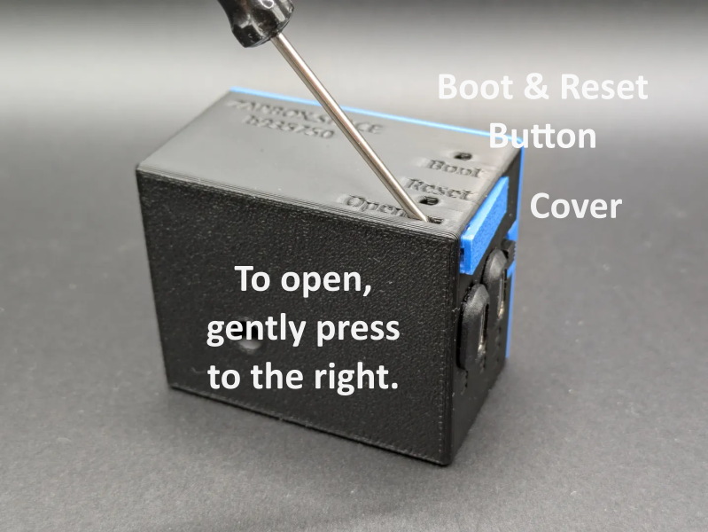

# ZapBox Headless – Operating Instructions

**Language:** English | **Version:** oi940432

---

## Table of Contents

1. [Overview](#overview)
2. [Views](#views)
3. [Connections](#connections)
4. [Controls](#controls)
5. [Setup and Commissioning](#setup-and-commissioning)
6. [Option: NFC Module](#option-nfc-module)
7. [Technical Specifications](#technical-specifications)
8. [Safety Information](#safety-information)
9. [Further Links](#further-links)

---

## Overview

The **ZapBox Headless** is an electronic switch for Bitcoin Lightning payments without a display. A payment via the Lightning Network can switch an output – ideal for embedded applications, concealed installations, mechanical engineering, and anywhere a display is not required.

The operating state is indicated exclusively via a **status LED**. A second **action LED** indicates the switching function.

### Basic Equipment

| Component | Description |
|---|---|
| Microcontroller | ESP32 Dev Module (no display) |
| Input | USB-C (Power IN) |
| Output | USB-C (Power OUT) |
| Status indicator | Status LED with blink patterns and action LED as feedback |
| Control | Micro button for BOOT (config mode) and reset |
| Switch | 3-position slide switch (AUTO / OFF / ON) |
| Option NFC Module | For Bolt Cards (NTAG424 DNA) and standard NTAG213/215/216 (with LNURL-withdraw) |

---

## Views

*Image 1: Front view / top view*

---

## Connections

### Input – USB-C Socket for Power Supply (5V)

Power the device via the **Power IN** connector with a USB-C cable at **5 V DC (max. 5 A)**.

> **Note:** The Power IN connector is not "intelligent". Some chargers or power modules with a USB-C output do not recognize the ZapBox and will not supply power. In this case, use a **USB-A output** of the power supply or a different power source.

---

### Input – Micro-USB Socket on the Microcontroller (Data Access, front)

To read data from or transfer data to the device, connect the ZapBox to a computer or laptop:

1. On the **front left**, there is a small panel to the left of the USB connectors. Open the panel by sliding it to the right from below using a **narrow screwdriver**.
2. Connect a Micro-USB cable to the microcontroller.

*Image 2: Opening the panel for data connection*

*Image 3: Micro USB port*

> **Important Note:** The USB connector directly on the microcontroller is intended exclusively for flashing the firmware and transferring configuration parameters. During the flashing process, no load may be connected or switched at the output, as this can cause malfunctions or **damage to the microcontroller**.
>
> It is therefore recommended:
> - not to connect any load to the output during the USB connection, or
> - to additionally connect the regular **Power IN input** to the same power supply. This ensures that the current for the power relay does not flow through the microcontroller and overload it.

---

### Output – USB-C Socket (Switched 5V Voltage)

The USB socket is switched via a relay switching contact. The **total load** of the sockets should **not exceed 3 A**.

---

## Controls

The ZapBox Headless has **no display**. The operating state is indicated exclusively via the **status LED** and **action LED**.

### Status LED – Blink Patterns

| Pattern | Meaning |
|---|---|
| 3× short blinks at startup | Boot completed |
| Rapid blinking | Establishing connection / initialization |
| Slow blinking (1 Hz) | Config mode active |
| Steady light | Ready for operation, waiting for payment |
| 200 ms on / 800 ms off | NFC payment pending |
| 2× short blinks | Payment successful |
| 3× short blinks | NFC timeout / error |
| 1× blink (500 ms on/off, 2 s pause) | Error pattern 1: No Wi-Fi |
| 2× blinks (300 ms on/off, 2 s pause) | Error pattern 2: No internet |
| 3× blinks (250 ms on/off, 2 s pause) | Error pattern 3: Server unreachable |
| 4× blinks (200 ms on/off, 2 s pause) | Error pattern 4: WebSocket connection failed |

### Control Buttons

| Function | Button |
|---|---|
| Enter config mode | Hold BOOT button for at least 5 seconds |
| Restart | Reset button |

### Triple Slide Switch (AUTO / OFF / ON)

| Position | Function |
|---|---|
| **A** (AUTO) | Automatic mode – Normal operation |
| **0** (OFF) | Power supply interrupted – Output OFF |
| **1** (ON) | Output (USB-C) permanently ON |

---

## Setup and Commissioning

The ZapBox is tested after manufacturing and delivered with the current firmware – however, it is not yet configured. The software is actively developed, so it is recommended to flash the ZapBox with the latest firmware right from the start and then perform a configuration. There is a convenient **Web Installer** (Headless version) for this purpose.

Here is a step-by-step guide for setup:

1. Connect the ZapBox to the Micro-USB port of the microcontroller with a cable and connect it to a computer.
2. Open a Chromium browser, for example Google Chrome, Microsoft Edge, Brave, Vivaldi, Opera, or [Helium](https://helium.computer/).
3. Navigate to the Web Installer page **https://installer.zapbox.space/headless/**.
4. Flash the latest "Latest" version (Headless), as described in step 1 of the Web Installer.
5. After flashing, close the small window and go to step 3 – Load config values. There, click the `🔌 Connect` button.
6. You should now see `✅ Connected` and `✅ Config mode` in the green field. Config mode is active as soon as the **status LED blinks slowly** (approx. 1 Hz). If not, check step 2 – Prepare connection.
7. The ZapBox requires three parameters: `WiFi SSID` / `WiFi password` / `Device settings string`. You get the device settings string from your LNbits wallet. Add the **Bitcoin Switch** or **ZapBox** extension for this. The ZapBox extension also supports the NFC module; otherwise they are identical.
8. After all three parameters have been entered, save them using the `🔥 Write Config` button and restart the ZapBox with the `🔁 Restart` button.

After initialization, the status LED lights up steadily – the ZapBox is ready for operation and waiting for the first payment.

In case of errors or malfunctions, please refer to the "Error Detection & Report" and "Troubleshoot" chapters further down on the Web Installer page.

---

## Option: NFC Module

Depending on the configuration, an NFC module may be installed on the **top of the ZapBox**. Alternatively, the module is also available separately. The ZapBox currently supports the following card types:

- **Boltcards** (NTAG424)
- **LNURL-Withdraw** from NTAG21x (213 / 215 / 216)

The LNbits [ZapBox Extension](https://github.com/AxelHamburch/zapbox_extension) is required for this function. It must be supported by the LNbits server.

---

## Technical Specifications

| Property | Value |
|---|---|
| Supply voltage | 5 V DC via USB-C |
| Maximum input current | 5.0 A |
| Output power | max. 3.0 A (recommended) |
| Microcontroller | ESP32 Dev Module (WROOM-32) |
| Flash memory | 4 MB |
| SRAM | 512 KB |
| Display | none (Headless) |
| Status indicator | Status LED / Action LED |
| Communication | Wi-Fi (ESP32) |
| Relay channels | 1 – Expandable up to 12 (CH01–CH12) |
| Payment protocol | Bitcoin Lightning Network |

---

## Safety Information

- Operate the device exclusively with the specified supply voltage.
- Do not exceed the maximum current loads of the outputs.
- Do not perform any work on the relay contacts under load.
- The device is not suitable for use in humid or wet environments.
- Keep out of reach of children.

---

## Further Links

| Resource | Link |
|---|---|
| Overview of all ZapBox models | https://zapbox.space/ |
| Web Installer, quick overview & troubleshooting | https://installer.zapbox.space/headless/ |
| Detailed documentation (parameters & functions) | https://ereignishorizont.xyz/zapbox/ |
| GitHub repository (software, PCB layouts, 3D print files, operating instructions) | https://github.com/AxelHamburch/ZapBox |
| ZapBox Extension | https://github.com/AxelHamburch/zapbox_extension |
| LNbits | https://lnbits.com/ |

---

*Subject to changes and errors. As of: 2026*
