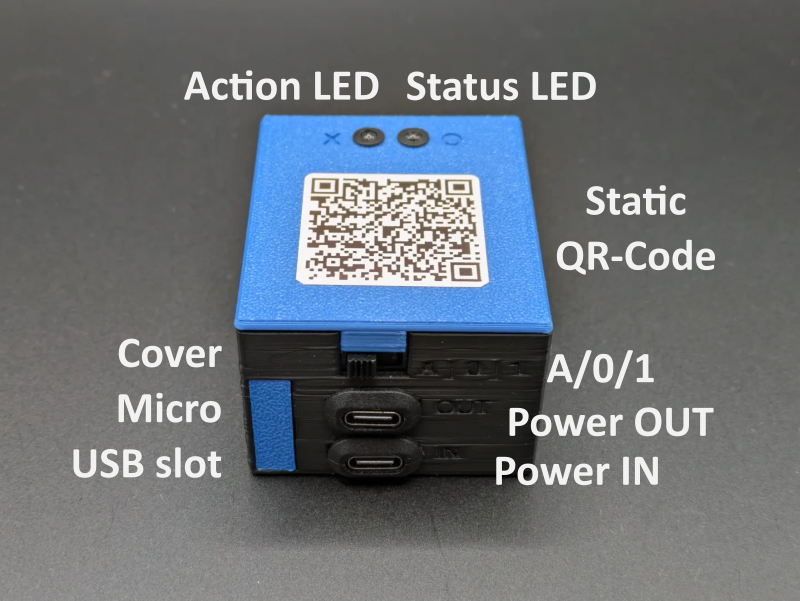
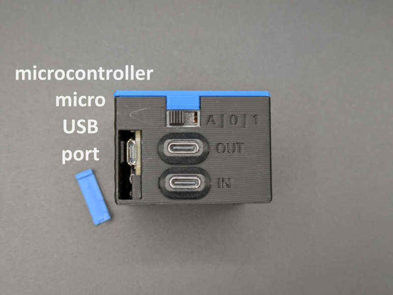
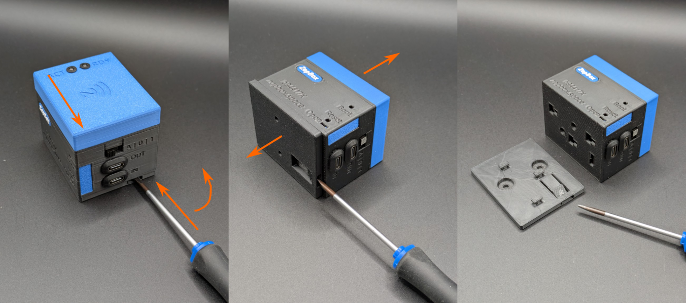

# ZapBox Headless – Bedienungsanleitung

**Sprache:** Deutsch | **Version:** oi944920

---

## Inhaltsverzeichnis

1. [Einleitung](#einleitung)
2. [Ansichten](#ansichten)
3. [Anschlüsse](#anschlüsse)
4. [Bedienelemente](#bedienelemente)
5. [Einrichtung und Inbetriebnahme](#einrichtung-und-inbetriebnahme)
6. [Option: NFC-Modul](#option-nfc-modul)
7. [Technische Daten](#technische-daten)
8. [Sicherheitshinweise](#sicherheitshinweise)
9. [Weiterführende Links](#weiterführende-links)

---

## Einleitung

Die **ZapBox Headless** ist ein elektronischer Schalter für Bitcoin-Lightning-Zahlungen ohne Display. Mit einer Zahlung über das Lightning-Netzwerk lässt sich ein Ausgang schalten – ideal für eingebettete Anwendungen, verdeckte Installationen, Maschinenbau und überall dort, wo kein Display benötigt wird.

Der Betriebszustand wird ausschließlich über eine **Status-LED** angezeigt. Eine zweite **Action-LED** zeigt die Schaltfunktion an.

*Bild 1: Frontansicht / Draufsicht*

### Grundausstattung

| Komponente | Beschreibung |
|---|---|
| Mikrocontroller | ESP32 Dev Module (kein Display) |
| Eingang | USB-C (Power IN) |
| Ausgang | USB-C (Power OUT) |
| Statusanzeige | Status-LED mit Blinkmustern und Action-LED als Rückmeldung |
| Bedienelement | Mikrotaster für BOOT (Config-Modus) und Reset |
| Schalter | 3-poliger Schiebeschalter (AUTO / OFF / ON) |
| Option NFC-Modul | Für Bolt Cards (NTAG424 DNA) und Standard NTAG213/215/216 (mit LNURL-withdraw) |

---

## Anschlüsse

### Eingang - USB-C Buchse zur Spannungsversorgung (5V)

Versorgen Sie das Gerät über den Anschluss **Power IN** mit einem USB-C-Kabel mit **5 V DC (max. 5 A)**.

> **Hinweis:** Der USB-Power-Anschluss unterstützt keine automatische USB-C-Leistungsanforderung (kein USB-C Power Delivery). Einige USB-C-Ladegeräte oder Powermodule erkennen die ZapBox daher nicht als Verbraucher und liefern keinen Strom. Verwenden Sie in diesem Fall einen **USB-A-Ausgang** der Spannungsversorgung oder eine alternative 5-V-Stromquelle. Die maximale Stromstärke darf 3 A nicht überschreiten.

---

### Eingang - Micro-USB Buchse am Mikrocontroller (Datenzugang, vorne)

Um Daten vom Gerät zu lesen oder zu übertragen, verbinden Sie die ZapBox mit einem Computer oder Laptop:

1. An der **Vorderseite links** befindet sich eine kleines Panel links neben den USB-Anschlüssen. Öffnen Sie das Panel, indem Sie von unten mit einem **schmalen Schraubendreher** das Panel nach rechts wegschieben.
2. Schließen Sie ein Micro-USB-Kabel an den Mikrocontroller an.

*Bild 2: Panel öffnen für Datenverbindung*

*Bild 3: Micro USB Port*

> **Wichtiger Hinweis:** Der USB-Anschluss direkt am Mikrocontroller ist ausschließlich zum Flashen der Firmware und zur Übertragung von Konfigurationsparametern vorgesehen. Während des Flashvorgangs darf keine Last am Ausgang angeschlossen oder geschaltet werden, da dies zu Fehlfunktionen oder zur **Beschädigung des Mikrocontrollers** führen kann.
>
> Es wird daher empfohlen:
> - während der USB-Verbindung keine Last am Ausgang anzuschließen oder
> - den regulären **Power-IN-Eingang** zusätzlich an dieselbe Spannungsversorgung anzuschließen. Dadurch wird sichergestellt, dass der Strom für das Leistungsrelais nicht über den Mikrocontroller fließt und diesen überlastet.

---

### Ausgang - USB-C-Buchse (geschaltete 5V Spannung)

Die USB-Buchse wird über einen Relais-Schaltkontakt geschaltet. Die **Gesamtbelastung** der Buchsen sollte **3 A nicht überschreiten**.

---

## Bedienelemente

Die ZapBox Headless hat **kein Display**. Der Betriebszustand wird ausschließlich über die **Status-LED** (GPIO 21 (extern) / GPIO 2 (onboard)) und **Action-LED** (GPIO 13) signalisiert.

### Status-LED – Blinkmuster

| Muster | Bedeutung |
|---|---|
| 3× kurzes Blinken beim Start | Boot abgeschlossen |
| Schnelles Blinken | Verbindungsaufbau / Initialisierung |
| Langsames Blinken (1 Hz) | Config-Modus aktiv |
| Dauerlicht | Betriebsbereit, wartet auf Zahlung |
| Kurzes Ausschalten (300 ms) | Aktion gestartet – Relais/Servo ausgelöst |
| 200 ms an / 800 ms aus | NFC-Zahlung ausstehend (PENDING) |
| 2× kurzes Blinken | Zahlung erfolgreich |
| 3× kurzes Blinken | NFC-Timeout / Fehler |
| Sehr schnelles Blinken (10 Hz) | Sensor "vending machine" angesprochen |
| 1× Blinken (500 ms an/aus, 2 s Pause) | Fehlermuster 1: Kein WLAN |
| 2× Blinken (300 ms an/aus, 2 s Pause) | Fehlermuster 2: Kein Internet |
| 3× Blinken (250 ms an/aus, 2 s Pause) | Fehlermuster 3: Server nicht erreichbar |
| 4× Blinken (200 ms an/aus, 2 s Pause) | Fehlermuster 4: WebSocket-Verbindung fehlgeschlagen |
| Aus | Keine Spannungsversorgung |

### Bedientaster

| Funktion | Taster |
|---|---|
| Config-Modus aufrufen | BOOT-Taster mind. 5 Sek. gedrückt halten |
| Neustart | Reset-Taster |

### Dreifach-Schiebeschalter (AUTO / OFF / ON)

| Stellung | Funktion |
|---|---|
| **A** (AUTO) | Automatikbetrieb – Normalbetrieb |
| **0** (OFF) | Spannungsversorgung unterbrochen – Ausgang AUS |
| **1** (ON) | Ausgang (USB-C) dauerhaft EIN |

### Montagehalterung mit Schnapp-Arretierung

*Bild 4: Lösen einer Montagehalter einer Headless mit NFC-Modul*

> **Hinweis:** Die ZapBox ist auf der Montagehalterung nur aufgeschoben und mit einem Schnappverschluss arretiert. Die Arretierung kann man mit einem flachen Schraubendreher lösen. Dazu den Schraubendreher vorsichtig in den Schlitz einschieben, leicht anheben und dabei den oberen Teil der ZapBox in Richtung des Schraubendrehers schieben. Die Verbindung sollte sich lösen und die ZapBox kann von der Montageplatte durch anheben gelöst werden.

---

## Einrichtung und Inbetriebnahme

Die ZapBox wird nach der Fertigung getestet und mit der aktuellen Firmware ausgeliefert - sie ist aber nicht parametriert. Die Software wird aktiv weiterentwickelt, daher ist es empfehlenswert, die ZapBox gleich zu Beginn einmal mit der neuesten Firmware zu bespielen und dann eine Parametrierung durchzuführen. Dafür gibt es einen komfortablen [**Web-Installer**](https://installer.zapbox.space/).

### Schritt 1: Firmware-Update
1. Öffnet das rechte Seitenpanel der Frontblende, wie oben unter "Seitenpanel öffnen" beschrieben.
2. Schließt die ZapBox an dem USB-C-Port mit einem Kabel an und verbindet es mit einem Computer.
3. Öffnet einen Chromium Browser, zum Beispiel Google Chrome, Microsoft Edge, Brave, Vivaldi, Opera oder [Helium](https://helium.computer/).

### Schritt 2: Parametrierung
1. Navigiert im Browser zur Web-Installer-Seite.
2. Folgt den Anweisungen auf der Seite, um die gewünschten Parameter wie `WiFi SSID`, `WiFi Passwort` und `Device Settings String` einzugeben.
3. Speichert die Einstellungen und startet die ZapBox neu.

> **Hinweis:** Während der Einrichtung sollte keine Last an den Ausgängen angeschlossen sein, um Fehlfunktionen oder Schäden am Mikrocontroller zu vermeiden.

Nach der Initialisierung leuchtet die Status-LED dauerhaft – die ZapBox ist betriebsbereit und wartet auf die erste Zahlung.

### Fehlerdiagnose und -behebung 

Die ZapBox zeigt Fehler über einen LED-Fehlerblinkcode an. Siehe dazu den vorherigen Kapitel *Status-LED – Blinkmuster*. Es gibt vier grundlegende Fehler, die priorisiert sind:

| Prio. | Fehlerart | Abkürzung | Erkennungsmethode | Beschreibung |
|-----------|-----------|-----------|-------------------|--------------|
| 1 | **NO WIFI** | NW | WiFi-Verbindungsstatus | WiFi-Netzwerk nicht verbunden -> Sind die WiFi-Daten korrekt? -> Ist das WiFi-Signal zu schwach? |
| 2 | **NO INTERNET** | NI | HTTP-Check zu Google | Internetverbindung verloren -> Ist das Internet erreichbar? |
| 3 | **NO SERVER** | NS | TCP-Port 443-Check | LNbits-Server nicht erreichbar -> Ist die Server-Hardware ausgefallen? -> Ist der Geräte-String korrekt? |
| 4 | **NO WEBSOCKET** | NWS | WebSocket-Verbindungsstatus | WebSocket-Protokoll-/Handshake-Fehler -> Ist LNbits ausgefallen? -> Ist der Geräte-String korrekt? |

Weitere aktuelle Informationen zu Fehlerbeschreibungen können auf der Web-Installer-Seite in den Kapiteln "Error Detection & Report" und "Troubleshoot" nachgelesen werden. 

---

## Option: NFC-Modul

Je nach Ausstattung ist auf der **Oberseite der ZapBox** ein NFC-Modul verbaut. Alternativ ist das Modul auch separat erhältlich. Die ZapBox unterstützt aktuell folgende Kartentypen:

- **Boltcards** (NTAG424)
- **LNURL-Withdraw** von NTAG21x (213 / 215 / 216)

Voraussetzung für die Funktion ist die LNbits [ZapBox Extension](https://github.com/AxelHamburch/zapbox_extension). Sie muss von dem LNbits Server unterstützt werden. 

---

## Technische Daten

| Eigenschaft | Wert |
|---|---|
| Versorgungsspannung | 5 V DC über USB-C |
| Maximaler Eingangsstrom | 5,0 A |
| Ausgangsleistung | max. 3,0 A (empfohlen) |
| Mikrocontroller | ESP32 Dev Module (WROOM-32) |
| Flash-Speicher | 4 MB |
| SRAM | 512 KB |
| Display | keines (Headless) |
| Statusanzeige | Status-LED / Action-LED |
| Temperaturbereich | 0–40 °C |
| Kommunikation | Wi-Fi (ESP32) |
| Relaiskanäle | 1 - Erweiterbar bis zu 12 (CH01–CH12) |
| Zahlungsprotokoll | Bitcoin Lightning Network |

---

## Sicherheitshinweise

- Betreiben Sie das Gerät ausschließlich mit der angegebenen Versorgungsspannung.
- Überschreiten Sie nicht die maximalen Strombelastungen der Ausgänge.
- Führen Sie keine Arbeiten an den Relaiskontakten unter Last durch.
- Das Gerät ist nicht für den Einsatz in feuchten oder nassen Umgebungen geeignet.
- Außerhalb der Reichweite von Kindern aufbewahren.

---

## Weiterführende Links

| Ressource | Link |
|---|---|
| Übersicht aller ZapBox-Modelle | https://zapbox.space/ |
| Web-Installer, Kurzübersicht & Fehlerbehebung | https://installer.zapbox.space/headless/ |
| Detaillierte Dokumentation (Parameter & Funktionen) | https://ereignishorizont.xyz/zapbox/ |
| GitHub-Repository (Software, E-Layouts, 3D-Druckdateien, Bedienungsanleitungen) | https://github.com/AxelHamburch/ZapBox |
| ZapBox Extension | https://github.com/AxelHamburch/zapbox_extension |
| LNbits | https://lnbits.com/ |

---

*Änderungen und Irrtümer vorbehalten. Stand: 2026*
