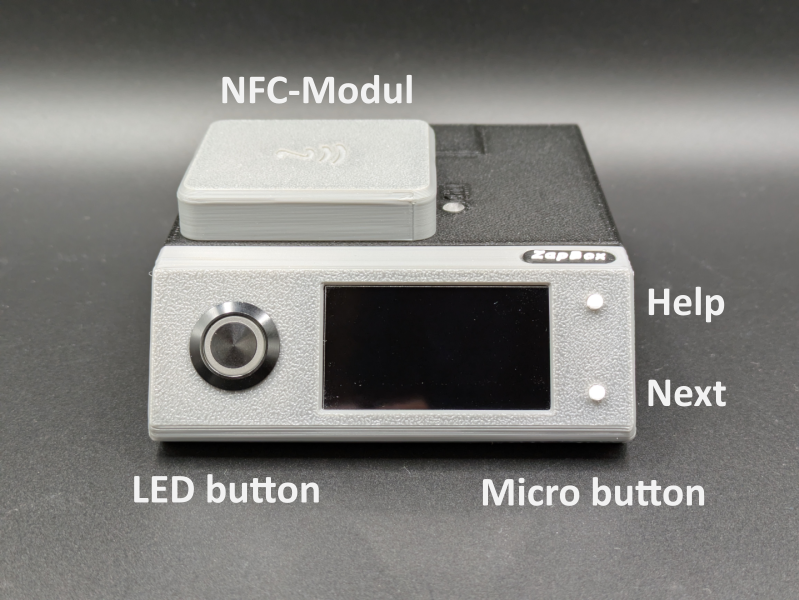
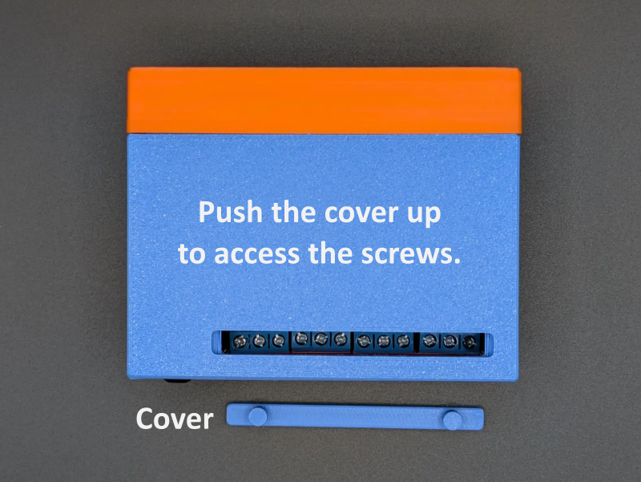

# ZapBox Quattro – Operating Instructions

**Language:** English | **Version:** oi940421

---

## Table of Contents

1. [Overview](#overview)
2. [Views](#views)
3. [Connections](#connections)
4. [Controls](#controls)
5. [Setup and Commissioning](#setup-and-commissioning)
6. [Option: NFC Module](#option-nfc-module)
7. [Technical Specifications](#technical-specifications)
8. [Safety Information](#safety-information)
9. [Further Links](#further-links)

---

## Overview

The **ZapBox Quattro** is an electronic switch for Bitcoin Lightning payments. A payment via the Lightning Network can switch an output – ideal for vending machines, presentations, event control, and many other applications.

### Basic Equipment

| Component | Description |
|---|---|
| Microcontroller | T-Display-S3 with 1.9" LCD display |
| Front panel | Available with 35° or 90° display front (90° also available for panel mounting) |
| Input | USB-C (Power IN) |
| Outputs CH1–CH4 | Four relay outputs, switching contacts (NO/COM/NC) externally accessible |
| Control | LED button (full ZapBox functionality) |
| Switch 1 | 3-position slide switch (AUTO / OFF / ON) |
| Switch 2 | 2-position slide switch (Invert Output) |
| Option BTC Ticker | Activatable via the Web Installer |
| Option Board Buttons | Two on-board micro buttons |
| Option NFC Module | For Bolt Cards (NTAG424 DNA) and standard NTAG213/215/216 (with LNURL-withdraw) |

---

## Views

*Image 1: Front view*

*Image 2: Rear view*

*Image 3: Top view*

---

## Connections

### Input – USB-C Socket for Power Supply (5V)

Power the device via the **Power IN** connector with a USB-C cable at **5 V DC (max. 5 A)**.

> **Note:** The Power IN connector is not "intelligent". Some chargers or power modules with a USB-C output do not recognize the ZapBox and will not supply power. In this case, use a **USB-A output** of the power supply or a different power source.

---

### Input – USB-C Socket on the Microcontroller (Data Access, behind right side panel)

To read data from or transfer data to the device, connect the ZapBox to a computer or laptop:

1. On the **right side of the front panel**, there is a small, concealed flap.
2. Open the flap by sliding it to the right from below using a **narrow screwdriver**.
3. Connect a USB-C cable to the connector on the microcontroller underneath.

*Image: Opening the panel and USB-C connector for data*

> **Important Note:** The USB connector directly on the microcontroller is intended exclusively for flashing the firmware and transferring configuration parameters. During the flashing process, no load may be connected or switched at the output, as this can cause malfunctions or **damage to the microcontroller**.
>
> It is therefore recommended:
> - not to connect any load to the output during the USB connection, or
> - to additionally connect the regular **Power IN input** to the same power supply. This ensures that the current for the power relay does not flow through the microcontroller and overload it.

---

### Outputs CH1–CH4

The Quattro has four relay outputs whose switching contacts (NO/COM/NC) are externally accessible. To access the screws for the terminal clamps, a narrow cover must be pried out. To do this, insert a small flat-head screwdriver into the two openings above the switching contacts and push the cover upward.

The contacts of the relays are rated for a **maximum current load of 10 A**.

---

## Controls

Depending on the version, the ZapBox has two small **on-board micro buttons** in addition to the **LED button**, directly connected to the microcontroller. All functions are accessible via both the LED button and the micro buttons. Additionally, the ZapBox has a reset button on the underside of the front panel and two slide switches on the side.

### Function Overview – Micro Buttons / LED Button

| Function | Micro Button | LED Button |
|---|---|---|
| Show help page | Press HELP 1× | Hold LED button for at least 2 seconds |
| Next page / product change | Press NEXT 1× | Press LED button 1× briefly |
| Show REPORT page | Press HELP 2× | Press LED button 3× in quick succession |
| Enter config mode | Hold NEXT for at least 5 seconds | Press 1× briefly, then hold for at least 5 seconds |

---

## Setup and Commissioning

The ZapBox is tested after manufacturing and delivered with the current firmware – however, it is not yet configured. The software is actively developed, so it is recommended to flash the ZapBox with the latest firmware right from the start and then perform a configuration. There is a convenient **Web Installer** for this purpose.

Here is a step-by-step guide for setup:

1. Open the right side panel of the front panel, as described above under "Input – USB-C Socket on the Microcontroller".
2. Connect the ZapBox to the USB-C port with a cable and connect it to a computer.
3. Open a Chromium browser, for example Google Chrome, Microsoft Edge, Brave, Vivaldi, Opera, or [Helium](https://helium.computer/).
4. Navigate to the Web Installer page **https://installer.zapbox.space/**.
5. Flash the latest "Latest" version, as described in step 1 of the Web Installer.
6. After flashing, close the small window and go to step 3 – Load config values. There, click the `🔌 Connect` button.
7. You should now see `✅ Connected` and `✅ Config mode` in the green field, provided the ZapBox is also in `SERIAL CONFIG MODE`. The display should show this. If not, check step 2 – Prepare connection.
8. The ZapBox requires three parameters: `WiFi SSID` / `WiFi password` / `Device settings string`. You get the device settings string from your LNbits wallet. Add the **Bitcoin Switch** or **ZapBox** extension for this. The ZapBox extension also supports the NFC module; otherwise they are identical.
9. After all three parameters have been entered, save them using the `🔥 Write Config` button and restart the ZapBox with the `🔁 Restart` button.

That should be all. After initialization, the ZapBox will display the QR code of the product and is ready for the first payment and subsequent action at the USB output.

In case of errors or malfunctions, please refer to the "Error Detection & Report" and "Troubleshoot" chapters further down on the Web Installer page.

---

## Option: NFC Module

Depending on the configuration, an NFC module may be installed on the **top of the ZapBox**. Alternatively, the module is also available separately. The ZapBox currently supports the following card types:

- **Boltcards** (NTAG424)
- **LNURL-Withdraw** from NTAG21x (213 / 215 / 216)

The LNbits [ZapBox Extension](https://github.com/AxelHamburch/zapbox_extension) is required for this function. It must be supported by the LNbits server.

---

## Technical Specifications

| Property | Value |
|---|---|
| Supply voltage | 5 V DC via USB-C |
| Maximum input current | 5.0 A |
| Switching power | max. 10 A |
| Display | 1.9" LCD (T-Display-S3) |
| Communication | Wi-Fi (ESP32-S3) |
| Payment protocol | Bitcoin Lightning Network |

---

## Safety Information

- Operate the device exclusively with the specified supply voltage.
- Do not exceed the maximum current loads of the outputs.
- Do not perform any work on the relay contacts under load.
- The device is not suitable for use in humid or wet environments.
- Keep out of reach of children.

---

## Further Links

| Resource | Link |
|---|---|
| Overview of all ZapBox models | https://zapbox.space/ |
| Web Installer, quick overview & troubleshooting | https://installer.zapbox.space/ |
| Detailed documentation (parameters & functions) | https://ereignishorizont.xyz/zapbox/ |
| GitHub repository (software, PCB layouts, 3D print files, operating instructions) | https://github.com/AxelHamburch/ZapBox |
| ZapBox Extension | https://github.com/AxelHamburch/zapbox_extension |
| LNbits | https://lnbits.com/ |

---

*Subject to changes and errors. As of: 2026*
