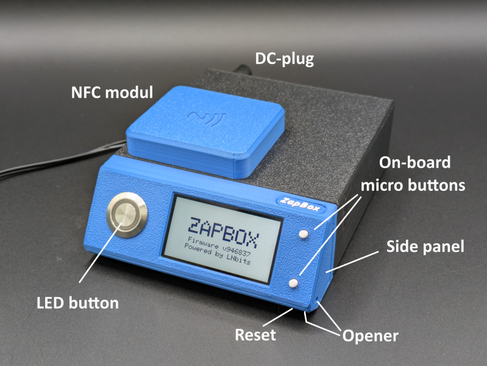
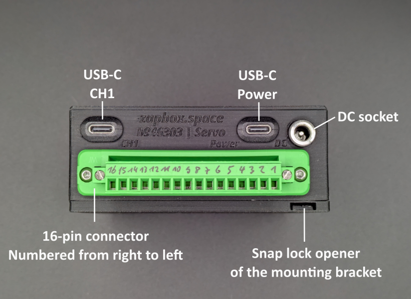
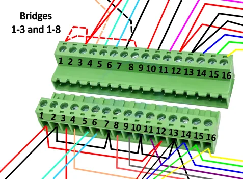
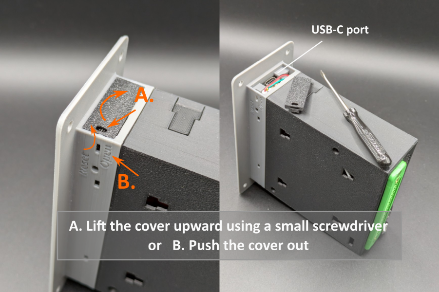
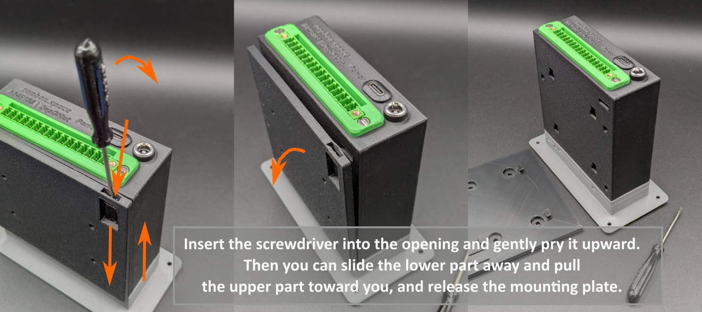

# ZapBox Servo – User Manual

**Language:** English | **Version:** oi947394

---

## Table of Contents

1. [Introduction](#introduction)
2. [Standard Equipment](#standard-equipment)
3. [Power Supply](#power-supply)
4. [16-Pin Connector](#16-pin-connector)
5. [Switching Outputs Channels 1 to 4](#switching-outputs-channels-1-to-4)
6. [Microcontroller Interface (ESP32)](#microcontroller-interface-esp32)
7. [Controls](#controls)
8. [Mounting Bracket with Snap Lock](#mounting-bracket-with-snap-lock)
9. [Setup and Commissioning](#setup-and-commissioning)
10. [NFC Module (Option)](#nfc-module-option)
11. [Technical Specifications](#technical-specifications)
12. [Safety Instructions](#safety-instructions)
13. [Further Links](#further-links)

---

## Introduction

The **ZapBox Servo** is an electronic switch for Bitcoin Lightning payments. A payment via the Lightning Network can trigger switching outputs – ideal for vending machines, presentations, event control, and many other applications.

For comprehensive automation tasks, the contacts are routed externally via a 16-pin removable connector. The device also features an additional sensor input that can be individually configured. Optionally, the NFC module can be routed externally via the connector strip.

For versatile use and easy connection, the Servo can be powered either via the 5 V USB-C port or via a DC barrel jack power supply. It features a wide-range input (DC 6–36 V) with a standard DC barrel socket (5.5 × 2.1 mm).
The required 5 V supply is generated internally via a self-regulating voltage converter. This significantly expands the range of applications, and the power supply for the outputs can be provided internally, independent of the 5 V supply.

*Figure 1: Front view and rear view*

*Figure 1: Rear view*

## Standard Equipment

| Component | Description |
|---|---|
| Microcontroller | T-Display-S3 with 1.9" LCD display |
| Front panel | Available with 35° or 90° display front (90° also available for panel mounting) |
| Power supply | USB-C (5 V) and wide-range input DC 6 V–36 V (barrel socket 5.5 × 2.1 mm) |
| Inputs / Outputs | 16-pin connector (15EDGWC 3.81 mm) |
| Outputs | 2 relay outputs CH1/CH4 – switching contacts (NO/COM/NC) |
| Outputs | 2 control outputs CH2/CH3 – GPIO outputs for servo control |
| Input | 1 sensor input |
| Interface | Connection for external NFC module |
| Control | LED button (full ZapBox functionality) |
| Option BTC ticker | Activatable via the Web Installer |
| Option board buttons | Two on-board micro buttons (optionally concealed) |
| Option NFC module | For Bolt Cards (NTAG424 DNA) and standard NTAG213/215/216 (with LNURL-withdraw) |
| Option switch | Slide switch (ON/OFF) |

---

## Power Supply

The ZapBox Servo features a USB-C port as well as a DC barrel socket (5.5 × 2.1 mm) for common DC plug-in power supplies.
The power supply for the outputs can be individually adapted: either externally via terminals 3 and 8, or internally by tapping the supply voltage of the wide-range input.

### USB-C Power Input (5 V)

The ZapBox can be powered via the USB-C **Power** port with **5 V DC (max. 3 A)**. The 5 V supply is routed to the outside via terminal 1 of the connector and can be bridged there to terminals 3 and 8 to supply the switching outputs.

> **Note:** The USB power port does not support automatic USB-C power negotiation (no USB-C Power Delivery). Some USB-C chargers or power modules may therefore not recognize the ZapBox as a load and will not supply power. In this case, use a **USB-A output** of the power supply or an alternative 5 V power source. The maximum current must not exceed 3 A.

### DC Barrel Socket Power Input (6 V–36 V)

The DC barrel socket is designed as a wide-range input for voltages from 6 V to 36 V and is suitable for common power supplies with, for example, 12 V or 24 V output voltage.
The input voltage is regulated internally via a step-down converter to 5 V. The voltage converter can deliver up to 1 A in continuous operation. **Heat generation must be taken into account ⚠️.**
Currents of up to 2 A are also possible briefly, and up to 2.5 A in very short load peaks.

Internally, it is possible to tap the input voltage and wire it to the connector strip to supply the output channels directly with the input voltage. This requires opening the device and must only be performed by qualified electricians. Details are described in the [E-Layout](https://github.com/AxelHamburch/ZapBox#electrical-layout) of the ZapBox Servo.

> **Note:** The internal voltage converter has limited capacity. High load currents generate increased heat dissipation, which may cause the device to heat up. Ensure adequate cooling and do not exceed the specified current limits.

### Power Supply Notes
- If a continuous power output of more than 1 A is required, it is recommended to use the USB-C power port with a separate 5 V power supply.
- In this case, up to 3 A is possible for the sum of all loads.
- The 5 V supply voltage for external loads can be tapped at terminals 1 and 2 of the connector. Terminal 3 supplies the switching output of channel 1 (CH1) and terminal 8 supplies the switching output of channel 4 (CH4). These terminals can also be used as supply voltage taps for servo motors.

#### Wiring Examples

Since individual loads, such as LED strips, can draw high currents (> 1 A), a combined feed is also possible.
For example, the ZapBox can be supplied with 12 V via the DC socket and simultaneously feed the relay contact at output 4 (CH4) with this voltage.
The internal voltage converter then supplies the system (ESP32) and outputs 1–3 (CH1–CH3) with 5 V, while a 12 V LED strip at output 4 is operated directly at 12 V. This reduces the load on the internal voltage converter.

Another common application is the operation of servo motors that require a higher supply voltage, e.g. HV servos (High Voltage) with voltages between 7.4 V and 8.4 V.
For this, the ZapBox is supplied, for example, with 8 V via the DC barrel input. Internally, the voltage is tapped before the voltage regulator and routed to the designated terminal 3 and GND. The external bridge between terminal 1 and terminal 3 must be removed for this purpose.

This supplies switching outputs 1 to 3 with 8 V and allows them to drive servo motors directly. The current load should not exceed 3 A, as this is currently the limit of the internal wiring.

Switching output 4 can be supplied with 5 V via a bridge between terminal 1 and terminal 8. Optionally, a different voltage, e.g. 12 V, can also be connected to terminal 8. Channel 4 can then be used, for example, to switch LED ambient lighting.

#### Additional Information

In addition to the DC supply (6 V–36 V), a 5 V power supply with a maximum of 3 A can be connected to the USB-C power port simultaneously.
Operating both supplies at the same time is possible, but differences in the 5 V voltages must be taken into account to avoid mutual interference or back-feeding of the power supplies.

## 16-Pin Connector

The ZapBox features a removable 16-pin connector (15EDGWC 3.81 mm).

**Terminal assignment overview:**
| Terminal | Function | Direction | Note |
|------|----------|-----------|---------------|
| 1 | 5 V | Output | 5 V power supply |
| 2 | GND | Output | Ground |
| 3 | Supply channels 1–3 | Input / Output | 5 V or 6 V–36 V |
| 4 | CH1 switching output channel 1 (GPIO pin 12) | Output | Load control (NO – Normally Open) |
| 5 | CH2 servo control signal 1 (GPIO pin 13) | Output | Servo motor control (pulsed, 3.3 V) |
| 6 | CH3 servo control signal 2 (GPIO pin 11) | Output | Servo motor control (pulsed, 3.3 V) |
| 7 | GND | Output | Ground |
| 8 | Supply channel 4 | Input / Output | 5 V or 6 V–36 V |
| 9 | CH4 switching output relay channel 4 (GPIO pin 11) | Output | Load control (NO – Normally Open) |
| 10 | GND | Output | Ground |
| 11 | Sensor (GPIO pin 2) | Input | E.g. for a light barrier (NPN) |
| 12 | 5 V | Output | 5 V for sensor and NFC module |
| 13 | GND | Output | Ground for sensor and NFC module |
| 14 | NFC IRQ (GPIO pin 1) | Interface | External NFC module |
| 15 | I2C SCL (GPIO pin 17) | Interface | External NFC module |
| 16 | I2C SDA (GPIO pin 18) | Interface | External NFC module |

**Note on terminal numbering:**

The terminals of the connector are numbered from right to left: terminal 1 is on the far right, terminal 16 on the far left. See Figure 2: Rear view.

The ZapBox Servo has four outputs (channel 1 to channel 4). Channels 1 and 4 are permanently connected to relays. Channels 2 and 3 are routed directly to the output terminals and are primarily intended for servo control.
The control signals of GPIO pins 13 and 10 are present at output terminals 5 and 6.

**Note on voltage distribution with bridges:**

In the factory default state, terminals 1 (general supply) and 12 (supply for sensor and NFC module) carry 5 V. Ground (GND) is routed to terminals 2, 7, 10, and 13.

The relay contacts have no internal supply voltage. The desired switching voltage must therefore be bridged externally.
To switch a 5 V load, for example, an external bridge on the 16-pin connector from terminal 1 to terminal 3 is required for channels 1–3.
To operate channel 4 with 5 V, an additional bridge from terminal 1 to terminal 8 must be set.

*Figure 3: E-layout excerpt – terminals that are bridged*

**Note on DC barrel socket (6 V–36 V for terminals 3 & 8):**

The input voltage of the DC barrel socket (6 V–36 V) can be tapped internally and routed to terminals 3 and/or 8 to operate relay outputs at higher voltages.

**Requirements:**
- Modifications must only be carried out by qualified electricians.
- Any existing 5 V bridges (terminal 1 → 3 and/or terminal 1 → 8) must be **removed beforehand**.
- Details can be found in the [E-Layout](https://github.com/AxelHamburch/ZapBox#electrical-layout) of the ZapBox Servo.

## Switching Outputs Channels 1 to 4

The Servo features four relay outputs, internally configured as normally open (NO) contacts, routed externally via terminals 4, 5, and 6 as well as terminal 9 of the connector. The normally open contacts of channels 1 to 3 are assigned to terminals 4, 5, and 6 respectively; channel 4 is wired to terminal 9.

If a relay contact is to be used as a normally closed (NC) contact, internal rewiring is required.

The switching outputs are rated for a maximum continuous current load of 3 A. Short-term loads of up to 5 A are permissible.

## Microcontroller Interface (ESP32)

### Opening the Side Panel
To read data from or transfer data to the device, connect the ZapBox to a computer or laptop:

1. On the **right side of the front panel**, there is a small cover.
2. Open the cover by sliding it to the right from below using a **narrow screwdriver**. On some models, the cover has a small notch that can be used to tilt the cover forward.

### Connecting the USB-C Cable
3. Connect a USB-C cable to the connector on the microcontroller underneath.

*Figure 4: Opening the panel and USB-C connection for data*

> **Important note:** The USB port directly on the microcontroller is intended exclusively for flashing firmware and transferring configuration parameters. No load must be switched on the output during the flashing process, as this may cause malfunctions or **damage to the microcontroller**.
>
> It is therefore recommended to:
> - not connect any load to the output during the USB connection, or
> - additionally connect the regular **Power IN input** to the same power supply. This ensures that the current for the power relay does not flow through the microcontroller and overload it.

---

## Controls

Depending on the version, the ZapBox features two **on-board micro buttons** in addition to the **LED button**, both directly connected to the microcontroller. All functions are accessible via either the LED button or the micro buttons. The ZapBox also features a reset button on the underside of the front panel and optionally a slide switch on the side for additional applications.

### Function Overview – Micro Buttons / LED Button

| Function | Micro button | LED button |
|---|---|---|
| Show help page | Press HELP 1× | Hold LED button for at least 2 sec. |
| Next page / product change | Press NEXT 1× | Press LED button 1× briefly |
| Show REPORT page | Press HELP 2× | Press LED button 3× in quick succession |
| Enter config mode | Hold NEXT for at least 5 sec. | Press 1× briefly, then hold for at least 5 sec. |

---

## Mounting Bracket with Snap Lock

With the optional mounting bracket, the ZapBox can be easily mounted.
The snap lock can be released with a flat screwdriver.

*Figure 5: Releasing the mounting bracket*

> **Note:** The ZapBox is only slid onto the mounting bracket and secured with a snap lock. The lock can be released with a flat screwdriver. To do this, carefully insert the screwdriver into the slot, lift slightly, and press the upper part of the ZapBox towards the screwdriver. The connection should release and the ZapBox can be separated from the mounting plate by lifting it.

---

## Setup and Commissioning

The ZapBox is tested after production and shipped with the current firmware – but it is not yet configured. The software is under active development, so it is recommended to flash the ZapBox with the latest firmware right at the start and then carry out the configuration. There is a convenient [**Web Installer**](https://installer.zapbox.space/) for this purpose.

### Step 1: Firmware Update
1. Open the right side panel of the front panel as described above under "Opening the Side Panel".
2. Connect the ZapBox to the USB-C port with a cable and connect it to a computer.
3. Open a Chromium-based browser, for example Google Chrome, Microsoft Edge, Brave, Vivaldi, Opera, or [Helium](https://helium.computer/).

### Step 2: Configuration
1. Navigate to the Web Installer page in the browser.
2. Follow the instructions on the page to enter the desired parameters such as `WiFi SSID`, `WiFi password`, and `Device Settings String`.
3. Save the settings and restart the ZapBox.

> **Note:** During setup, no load should be connected to the outputs to avoid malfunctions or damage to the microcontroller.

After initialization, the ZapBox will display the QR code of the product and is ready for the first payment and subsequent switching action.

### Troubleshooting

The ZapBox features a convenient error display via the screen. There are four fundamental errors, listed in order of priority:

| Priority | Error type | Abbreviation | Detection method | Description |
|-----------|-----------|-----------|-------------------|--------------|
| 1 | **NO WIFI** | NW | WiFi connection status | WiFi network not connected -> Is the WiFi data correct? -> Is the WiFi signal too weak? |
| 2 | **NO INTERNET** | NI | HTTP check to Google | Internet connection lost -> Is the internet reachable? |
| 3 | **NO SERVER** | NS | TCP port 443 check | LNbits server not reachable -> Has the server hardware failed? -> Is the device string correct? |
| 4 | **NO WEBSOCKET** | NWS | WebSocket connection status | WebSocket protocol/handshake error -> Is LNbits down? -> Is the device string correct? |

Error messages are also logged and can be retrieved via *Report Mode*:

- Press the HELP button twice in quick succession to display error counters (0–99) for all four error types with their frequency of occurrence.
- Press the LED button three times in quick succession (if an external LED button is available).

Further up-to-date information on error descriptions can be found on the Web Installer page in the sections "Error Detection & Report" and "Troubleshoot".

---

## NFC Module (Option)

Depending on the configuration, the ZapBox features an NFC module that is either mounted on the top or can be used externally as a separate module via the 16-pin connector.

The ZapBox currently supports the following card types:

- **Bolt Cards** (NTAG424 DNA)
- **LNURL-Withdraw** from NTAG21x (213 / 215 / 216)

A prerequisite for this functionality is the LNbits [ZapBox Extension](https://github.com/AxelHamburch/zapbox_extension), which must be supported by the LNbits server.

---

## Technical Specifications

| Property | Value |
|---|---|
| Supply voltage | 5 V DC via USB-C, max. 3 A |
| Supply voltage | 6 V–36 V via DC barrel socket, max. 3 A at 24 V |
| DC-DC voltage converter | 6 V–36 V → 5 V, max. 1 A continuous, 2 A briefly (2.5 A peak) |
| Relay switching outputs | Max. 3 A continuous (5 A briefly) |
| Display | 1.9" LCD (T-Display-S3) |
| NFC module | PN532 |
| Operating temperature | 0–40 °C |
| Communication | Wi-Fi (ESP32-S3) |
| Payment protocol | Bitcoin Lightning Network |

---

## Safety Instructions

- Operate the device exclusively with the specified supply voltage.
- Do not exceed the maximum current ratings of the outputs.
- Do not perform any work on the relay contacts under load.
- The device is not suitable for use in humid or wet environments.
- Ensure adequate ventilation around the device. Do not block the ventilation openings and avoid installing the device in enclosed, poorly ventilated enclosures. At higher continuous loads or elevated ambient temperatures, additional active cooling may be required.
- Keep out of reach of children.

---

## Further Links

| Resource | Link |
|---|---|
| Overview of all ZapBox models | https://zapbox.space/ |
| Web Installer, quick overview & troubleshooting | https://installer.zapbox.space/ |
| Detailed documentation (parameters & functions) | https://ereignishorizont.xyz/zapbox/ |
| GitHub repository (software, 3D print files, manuals, etc.) | https://github.com/AxelHamburch/ZapBox |
| GitHub repository (E-layouts) | https://github.com/AxelHamburch/ZapBox#electrical-layout |
| ZapBox Extension | https://github.com/AxelHamburch/zapbox_extension |
| LNbits | https://lnbits.com/ |

---

*Subject to changes and errors. As of: 2026*
