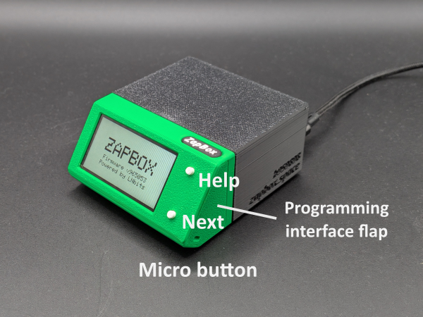
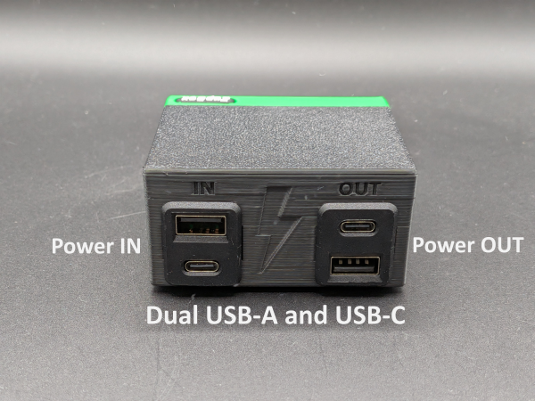
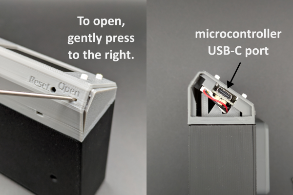

# ZapBox Simple – Bedienungsanleitung

**Sprache:** Deutsch | **Version:** oi967281

---

## Inhaltsverzeichnis

1. [Übersicht](#übersicht)
2. [Ansichten](#ansichten)
3. [Anschlüsse](#anschlüsse)
4. [Bedienelemente](#bedienelemente)
5. [Einrichtung und Inbetriebnahme](#einrichtung-und-inbetriebnahme)
6. [Technische Daten](#technische-daten)
7. [Sicherheitshinweise](#sicherheitshinweise)
8. [Weiterführende Links](#weiterführende-links)

---

## Übersicht

Die **ZapBox Compact** ist ein elektronischer Schalter für Bitcoin-Lightning-Zahlungen. Mit einer Zahlung über das Lightning-Netzwerk lässt sich ein Ausgang schalten – ideal für Automaten, Präsentationen, Eventsteuerung und viele weitere Anwendungen.

### Grundausstattung

| Komponente | Beschreibung |
|---|---|
| Mikrocontroller | T-Display-S3 mit 1,9" LCD-Display |
| Frontpanel | 35° Display |
| Eingang | Dual USB-A und USB-C |
| Ausgang | Dual USB-A und USB-C |
| Bedienelement | Zwei On-board-Mikrotaster |
| Option BTC-Ticker | Aktivierbar über den Web Installer |

---

## Ansichten

*Bild 1: Frontansicht*

*Bild 2: Rückansicht*

---

## Anschlüsse

### Eingang - Dual USB-A und USB-C Buchse zur Spannungsversorgung (5V)

Versorgen Sie das Gerät über den Anschluss **Power IN** mit einem USB-C/A-Kabel mit **5 V DC (max. 5 A)**.

> **Hinweis:** Der USB-Power-Anschluss unterstützt keine automatische USB-C-Leistungsanforderung (kein USB-C Power Delivery). Einige USB-C-Ladegeräte oder Powermodule erkennen die ZapBox daher nicht als Verbraucher und liefern keinen Strom. Verwenden Sie in diesem Fall einen **USB-A-Ausgang** der Spannungsversorgung oder eine alternative 5-V-Stromquelle. Die maximale Stromstärke darf 3 A nicht überschreiten.

---

### Eingang - USB-C Buchse am Mikrocontroller (Datenzugang, hinter rechtem Seitenpanel)

Um Daten vom Gerät zu lesen oder zu übertragen, verbinden Sie die ZapBox mit einem Computer oder Laptop:

1. An der **rechten Seite der Frontblende** befindet sich eine kleine, verdeckte Klappe.
2. Öffnen Sie die Klappe, indem Sie von unten mit einem **schmalen Schraubendreher** die Klappe nach rechts wegschieben.
3. Schließen Sie ein USB-C-Kabel am darunter liegenden Anschluss des Mikrocontrollers an.

*Bild: Panel öffnen und USB-C-Anschluss für Daten*

> **Wichtiger Hinweis:** Der USB-Anschluss direkt am Mikrocontroller ist ausschließlich zum Flashen der Firmware und zur Übertragung von Konfigurationsparametern vorgesehen. Während des Flashvorgangs darf keine Last am Ausgang angeschlossen oder geschaltet werden, da dies zu Fehlfunktionen oder zur **Beschädigung des Mikrocontrollers** führen kann.
>
> Es wird daher empfohlen:
> - während der USB-Verbindung keine Last am Ausgang anzuschließen oder
> - den regulären **Power-IN-Eingang** zusätzlich an dieselbe Spannungsversorgung anzuschließen. Dadurch wird sichergestellt, dass der Strom für das Leistungsrelais nicht über den Mikrocontroller fließt und diesen überlastet.

---

### Fehlerdiagnose und -behebung 

Die ZapBox verfügt über eine komfortable Fehleranzeige über das Display. Es gibt vier grundlegende Fehler, die priorisiert sind:

| Prio. | Fehlerart | Abkürzung | Erkennungsmethode | Beschreibung |
|-----------|-----------|-----------|-------------------|--------------|
| 1 | **NO WIFI** | NW | WiFi-Verbindungsstatus | WiFi-Netzwerk nicht verbunden -> Sind die WiFi-Daten korrekt? -> Ist das WiFi-Signal zu schwach? |
| 2 | **NO INTERNET** | NI | HTTP-Check zu Google | Internetverbindung verloren -> Ist das Internet erreichbar? |
| 3 | **NO SERVER** | NS | TCP-Port 443-Check | LNbits-Server nicht erreichbar -> Ist die Server-Hardware ausgefallen? -> Ist der Geräte-String korrekt? |
| 4 | **NO WEBSOCKET** | NWS | WebSocket-Verbindungsstatus | WebSocket-Protokoll-/Handshake-Fehler -> Ist LNbits ausgefallen? -> Ist der Geräte-String korrekt? |

Die Fehlermeldungen werden auch geloggt und können über den *Report Mode* abgerufen werden:

- Drücken Sie die HELP-Taste zweimal schnell hintereinander, um Fehlerzähler (0-99) für alle vier Fehlertypen mit ihren Auftretenshäufigkeiten anzuzeigen.
- Drücken Sie die LED-Taste dreimal schnell hintereinander (falls eine externe LED-Taste verfügbar ist).

Weitere aktuelle Informationen zu Fehlerbeschreibungen können auf der Web-Installer-Seite in den Kapiteln "Error Detection & Report" und "Troubleshoot" nachgelesen werden. 

---

### Ausgang - Dual USB-A und USB-C (geschaltete 5V Spannung)

Die USB-Buchse wird über einen Relais-Schaltkontakt geschaltet. Die **Gesamtbelastung** der Buchsen sollte **3 A nicht überschreiten**.

---

## Bedienelemente

Die ZapBox verfügt über zwei kleine **On-board-Mikrotaster**, die direkt mit dem Mikrocontroller verbunden sind. Alle Funktionen sind über die Mikrotaster erreichbar. Zusätzlich hat die ZapBox an der Unterseite des Frontpanels einen Reset Taster und an der Seite zwei Schiebeschalter.

### Funktionsübersicht - Mikrotaster

| Funktion | Mikrotaster |
|---|---|
| Hilfe-Seite anzeigen | 1× HELP drücken | 
| Nächste Seite / Produktwechsel | 1× NEXT drücken |
| REPORT-Seite anzeigen | 2× HELP drücken | 
| Config-Modus aufrufen | NEXT mind. 5 Sek. gedrückt halten |

---

## Einrichtung und Inbetriebnahme

Die ZapBox wird nach der Fertigung getestet und mit der aktuellen Firmware ausgeliefert - sie ist aber nicht parametriert. Die Software wird aktiv weiterentwickelt, daher ist es empfehlenswert, die ZapBox gleich zu Beginn einmal mit der neuesten Firmware zu bespielen und dann eine Parametrierung durchzuführen. Dafür gibt es einen komfortablen [**Web-Installer**](https://installer.zapbox.space/).

### Schritt 1: Firmware-Update
1. Öffnet das rechte Seitenpanel der Frontblende, wie oben unter "Eingang - USB-C Buchse am Mikrocontroller" beschrieben.
2. Schließt die ZapBox an dem USB-C-Port mit einem Kabel an und verbindet es mit einem Computer.
3. Öffnet einen Chromium Browser, zum Beispiel Google Chrome, Microsoft Edge, Brave, Vivaldi, Opera oder [Helium](https://helium.computer/).

### Schritt 2: Parametrierung
1. Navigiert im Browser zur Web-Installer-Seite.
2. Folgt den Anweisungen auf der Seite, um die gewünschten Parameter wie `WiFi SSID`, `WiFi Passwort` und `Device Settings String` einzugeben.
3. Speichert die Einstellungen und startet die ZapBox neu.

> **Hinweis:** Während der Einrichtung sollte keine Last an den Ausgängen angeschlossen sein, um Fehlfunktionen oder Schäden am Mikrocontroller zu vermeiden.

Die ZapBox wird nach der Initialisierung den QR-Code des Produkts anzeigen und ist bereit für die erste Zahlung und anschließende Schaltaktion. 

---

## Technische Daten

| Eigenschaft | Wert |
|---|---|
| Versorgungsspannung | 5 V DC über USB-C |
| Maximaler Eingangsstrom | 5,0 A |
| Ausgangsleistung | max. 3,0 A (empfohlen) |
| Display | 1,9" LCD (T-Display-S3) |
| Temperaturbereich | 0–40 °C |
| Kommunikation | Wi-Fi (ESP32-S3) |
| Zahlungsprotokoll | Bitcoin Lightning Network |

---

## Sicherheitshinweise

- Betreiben Sie das Gerät ausschließlich mit der angegebenen Versorgungsspannung.
- Überschreiten Sie nicht die maximalen Strombelastungen der Ausgänge.
- Führen Sie keine Arbeiten an den Relaiskontakten unter Last durch.
- Das Gerät ist nicht für den Einsatz in feuchten oder nassen Umgebungen geeignet.
- Sorgen Sie für ausreichende Belüftung um das Gerät. 
- Außerhalb der Reichweite von Kindern aufbewahren.

---

## Weiterführende Links

| Ressource | Link |
|---|---|
| Übersicht aller ZapBox-Modelle | https://zapbox.space/ |
| Web-Installer, Kurzübersicht & Fehlerbehebung | https://installer.zapbox.space/ |
| Detaillierte Dokumentation (Parameter & Funktionen) | https://ereignishorizont.xyz/zapbox/ |
| GitHub-Repository (Software, E-Layouts, 3D-Druckdateien, Bedienungsanleitungen, etc.) | https://github.com/AxelHamburch/ZapBox |
| ZapBox Extension | https://github.com/AxelHamburch/zapbox_extension |
| LNbits | https://lnbits.com/ |

---

*Änderungen und Irrtümer vorbehalten. Stand: 2026*
