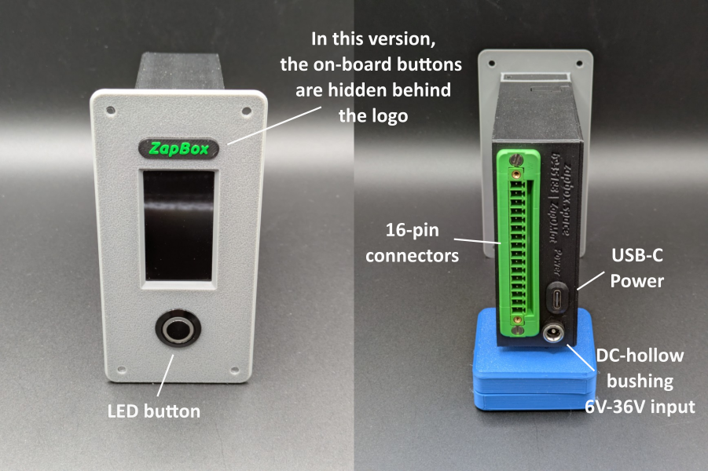
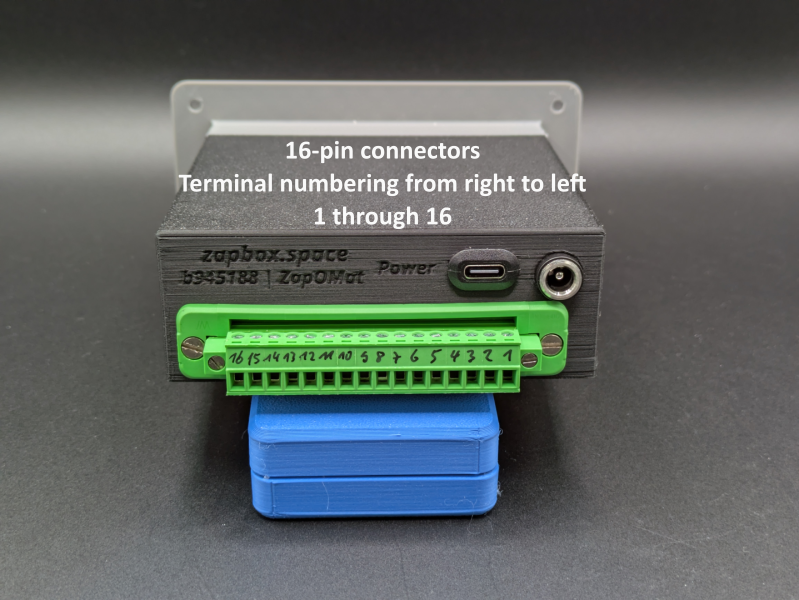

# ZapBox ZapOMat – Bedienungsanleitung

**Sprache:** Deutsch | **Version:** oi946210

---

## Inhaltsverzeichnis

1. [Einleitung](#einleitung)
2. [Spannungsversorgung](#spannungsversorgung)
3. [Externe Anschlüsse – 16-poliger Steckverbinder](#externe-anschlüsse--16-poliger-steckverbinder)
4. [USB-C-Anschluss](#usb-c-anschluss)
5. [Schaltausgänge Kanal 1 bis 4](#schaltausgänge-kanal-1-bis-4)
6. [Bedienelemente](#bedienelemente)
7. [Montagehalterung mit Schnapp-Arretierung](#montagehalterung-mit-schnapp-arretierung) 
8. [Einrichtung und Inbetriebnahme](#einrichtung-und-inbetriebnahme)
9. [NFC-Modul (Option)](#nfc-modul-option)
10. [Technische Daten](#technische-daten)
11. [Sicherheitshinweise](#sicherheitshinweise)
12. [Weiterführende Links](#weiterführende-links)

---

## Einleitung

Die **ZapBox ZapOMat** ist ein elektronischer Schalter für Bitcoin-Lightning-Zahlungen. Mit einer Zahlung über das Lightning-Netzwerk lassen sich Ausgänge schalten – ideal für Automaten, Präsentationen, Eventsteuerung und viele weitere Anwendungen. 

Für umfängliche Automatisierungsaufgaben sind die Kontakte über einen 16-poligen abnehmbaren Steckverbinder nach außen geführt. Sie verfügt über einen zusätzlichen Sensoreingang, der individuell parametriert werden kann. Optional kann das NFC-Modul über die Steckerleiste extern geführt werden. 

Für den industriellen Einsatz und komfortablen Anschluss kann die ZapOMat, alternativ zum 5V USB-C-Anschluss, mit einem DC-Steckernetzteil betrieben werden. Die ZapOMat kann dafür optional mit einem Weitbereichseingang (DC 6V–36V) über eine Standard 5,5×2,1 mm DC-Buchse angeschlossen werden. Für die intern benötigten 5V ist ein Spannungswandler vorhanden, der selbstregulierend ist. Das erweitert die Anwendungsmöglichkeiten enorm und die Spannungsversorgung für die Ausgänge kann dementsprechend angepasst werden.

*Bild 1: Frontansicht und Rückansicht*

## Grundausstattung

| Komponente | Beschreibung |
|---|---|
| Mikrocontroller | T-Display-S3 mit 1,9" LCD-Display |
| Frontpanel | Wahlweise mit 35° oder 90° Display Front (90° auch Einbau erhältlich) |
| Spannungsversorgung | USB-C (5V) und Weitbereichseingang DC 6V-36V (Hohlbuchse 5,5*2,1 mm) |
| Eingänge / Ausgänge | 16-polige Steckverbinder (15EDGWC-3,81mm) |
| Ausgänge | 4 Relaisausgänge CH1-CH4 - Schaltkontakte (NO/COM/NC) |
| Eingang | 1 Sensoreingang |
| Interface | Anschluss für externes NFC-Modul |
| Bedienelement | LED-Button (volle ZapBox-Funktionalität) |
| Option BTC-Ticker | Aktivierbar über den Web Installer |
| Option Boardtaster | Zwei On-board-Mikrotaster (optional verdeckt)|
| Option NFC-Modul | Für Bolt Cards (NTAG424 DNA) und Standard NTAG213/215/216 (mit LNURL-withdraw) |
| Option Schalter | Schiebeschalter (ON/OFF) |

---

## Spannungsversorgung

Die ZapBox ZapOMat verfügt über einen USB-C-Anschluss sowie über eine DC-Hohlsteckerbuchse (5,5 × 2,1 mm) für gängige DC-Steckernetzteile.

### USB-C-Anschluss
Der USB-C-Anschluss ermöglicht die Stromversorgung mit 5 V und eignet sich für einfache Anwendungen und einem Strombedarf bis max. 3 Ampere.

### DC-Hohlsteckerbuchse
Die DC-Buchse ist als Weitbereichseingang für Spannungen von 6 V bis 36 V ausgelegt. Die Eingangsspannung wird intern über einen Step-Down-Converter auf 5 V geregelt. Der Spannungswandler kann im Dauerbetrieb bis zu 1 A liefern. **Die Wärmeentwicklung ist dabei zu beachten ⚠️.** Kurzzeitig sind auch 2 A möglich, in sehr kurzen Lastspitzen bis zu 2,5 A.

### Hinweise zur Stromversorgung
- Wird dauerhaft eine Leistungsabgabe von mehr als 1 A benötigt, wird empfohlen, den USB-C-Power-Anschluss mit einem separaten 5-V-Netzteil zu verwenden.
- In diesem Fall sind für die Summe aller Verbraucher bis zu 3 A möglich.

Da einzelne Verbraucher, wie z. B. LED-Streifen, hohe Ströme (> 1 A) aufnehmen können, ist auch eine kombinierte Einspeisung möglich. Beispielsweise kann die ZapBox über die DC-Buchse mit 12 V versorgt werden und gleichzeitig den Relaiskontakt am Ausgang 4 mit dieser Spannung speisen. Der interne Spannungswandler versorgt dabei das System sowie die Relaisausgänge 1–3 mit 5 V, während eine 12-V-LED-Leiste am Ausgang 4 direkt mit 12 V betrieben wird. Dadurch wird die Belastung des internen Spannungswandlers reduziert.

Eine weitere oft benötigte Variante ist der Betrieb von 24V Motoren an den Schaltausgängen. Dazu wird die ZapBox an dem DC-Buchseneingang mit 24V versorgt und intern die Spannung vor dem Spannungsregler abgegriffen und auf die dafür vorgesehene Klemme 3 und GND verdrahtet. Die externe Brücke zwischen Klemme 1 und Klemme 3 muss dafür entfallen. Damit sind die Schaltausgänge 1 bis 3 mit 24V gespeist und können 24V Motoren antreiben. In Summe aber nicht mehr als 3 Ampere. Der Schaltausgang 4 kann mit einer Brücke zwischen 1 und 8 mit 5 V gespeist werden. Damit kann der Kanal 4 dann z.B. für ein LED-Licht als Ambientlicht für den Hintergrund geschaltet werden.

Zusätzlich kann neben der DC-Versorgung (6 V–36 V) ein 5-V-Netzteil mit maximal 3 A am USB-C-Power-Anschluss angeschlossen werden.
Der gleichzeitige Betrieb beider Versorgungen ist möglich, jedoch sind Unterschiede der 5-V-Spannungen zu beachten, um gegenseitige Beeinflussung oder Rückspeisung der Netzteile zu vermeiden.

### Spannungseingang USB-C Buchse (5V) 

Die ZapBox kann über den USB-C-Anschluss **Power** mit **5 V DC (max. 3 A)** versorgt werden. Über diesen Anschluss können die 5 V ebenfalls abgegriffen werden, wenn die Spannungsversorgung über die DC-Hohlsteckerbuchse erfolgt.

> **Hinweis:** Der USB-Power-Anschluss unterstützt keine automatische USB-C-Leistungsanforderung (kein USB-C Power Delivery). Einige USB-C-Ladegeräte oder Powermodule erkennen die ZapBox daher nicht als Verbraucher und liefern keinen Strom. Verwenden Sie in diesem Fall einen **USB-A-Ausgang** der Spannungsversorgung oder eine alternative 5-V-Stromquelle. Die maximale Stromstärke darf 3 A nicht überschreiten.

### Spannungseingang DC-Hohlsteckerbuchse (6 V–36 V)

Die DC-Buchse ist für Hohlstecker des Typs 5,5 × 2,1 mm ausgelegt und eignet sich für gängige Netzteile, z. B. mit 12 V oder 24 V Ausgangsspannung.

Intern besteht die Möglichkeit, die Eingangsspannung abzugreifen und auf die Steckerleiste zu verdrahten, um die Ausgangskanäle direkt mit der Eingangsspannung zu versorgen. Dies erfordert einen Eingriff in das Gerät und darf ausschließlich von elektrotechnischen Fachkräften durchgeführt werden. Details hierzu sind im [E-Layout](https://github.com/AxelHamburch/ZapBox#electrical-layout) der ZapBox ZapOMat beschrieben.

> **Hinweis:** Der interne Spannungswandler besitzt eine begrenzte Leistungsfähigkeit. Bei hohen Lastströmen entsteht erhöhte Wärmeentwicklung, die zu einer Erwärmung des Geräts führen kann. Sorgen Sie für ausreichende Kühlung und überschreiten Sie die angegebenen Stromgrenzen nicht.

## Externe Anschlüsse – 16-poliger Steckverbinder

Die ZapBox verfügt über einen abnehmbaren 16-poligen Steckverbinder.

**Klemmenbelegung in der Übersicht:**
| Klemme | Funktion | Verwendung | Hinweis |
|------|----------|-----------|---------------|
| 1 | 5 V | Ausgang | Spannungsversorgung 5 V |
| 2 | GND | Ausgang | Masse / 0 V |
| 3 | Versorgung Kanal 1-3 | Eingang / Ausgang | 5 V oder 6 V–36 V |
| 4 | Schaltkontakt (NO) Relais Kanal 1 | Ausgang | Ansteuerung Verbraucher (NO – Normally Open) |
| 5 | Schaltkontakt (NO) Relais Kanal 2 | Ausgang | Ansteuerung Verbraucher (NO – Normally Open) |
| 6 | Schaltkontakt (NO) Relais Kanal 3 | Ausgang | Ansteuerung Verbraucher (NO – Normally Open) |
| 7 | GND | Ausgang | Masse / 0 V  |
| 8 | Versorgung Kanal 4 | Eingang / Ausgang | 5 V oder 6 V–36 V |
| 9 | Schaltkontakt (NO) Relais Kanal 4 | Ausgang | Ansteuerung Verbraucher (NO – Normally Open) |
| 10 | GND| Ausgang | Masse / 0 V |
| 11 | Sensor (GPIO Pin 2) | Eingang | Für z.B. eine Lichtschranke (NPN) |
| 12 | 5 V | Ausgang | 5 V für Sensor und NFC-Modul |
| 13 | GND | Ausgang | Masse für Sensor und NFC-Modul |
| 14 | NFC IRQ (GPIO Pin 1) | Schnittstelle | Externes NFC-Modul |
| 15 | I2C SCL (GPIO Pin 17) | Schnittstelle | Externes NFC-Modul |
| 16 | I2C SDA (GPIO Pin 18) | Schnittstelle | Externes NFC-Modul |

*Bild 2: Reihenfolge Klemmenbelegung Steckverbinder, von rechts nach links*

**Hinweis Spannungsverteilung mit Brücken:** 

Im Werkszustand werden die Klemmen 1 (Versorgung Allgemein) und 12 (Versorgung Sensor und NFC-Modul) mit 5 V belegt. Die Masse (GND) ist auf den Klemmen 2, 7, 10 und 13 verdrahtet. 

Die Relaiskontakte besitzen keine interne Versorgungsspannung. Die gewünschte Schaltspannung muss extern aufgebrückt werden. Um beispielsweise einen 5-V-Verbraucher zu schalten, muss für die Kanäle 1–3 eine externe Brücke (auf dem 16-poligen Steckverbinder) von Klemme 1 auf Klemme 3 gesetzt werden. Für den Betrieb von Kanal 4 mit 5 V ist eine Brücke von Klemme 1 auf Klemme 8 erforderlich.

**Hinweis zu den Relaiskontakten:** 

Die Relaiskontakte sind intern als Schließer (NO – Normally Open) ausgeführt und über die Klemmen 4, 5 und 6 sowie Klemme 9 nach außen geführt. Soll ein Relaiskontakt als Öffner (NC – Normally Closed) verwendet werden, ist eine interne Umverdrahtung erforderlich.

**Hinweis zu DC-Buchse (6 V–36 V für Klemmen 3 & 8):** 

Die Eingangsspannung der DC-Hohlsteckerbuchse (6 V–36 V) kann intern abgegriffen und auf die Klemmen 3 und/oder 8 geführt werden, um Relaisausgänge mit höheren Spannungen zu schalten.

**Voraussetzungen:**
- Eingriffe dürfen ausschließlich durch elektrotechnische Fachkräfte erfolgen.
- Die ggf. vorhandenen 5-V-Brücken (Klemme 1 → 3 und/oder Klemme 1 → 8) müssen **zuvor** entfernt werden.
- Details sind dem [E-Layout](https://github.com/AxelHamburch/ZapBox#electrical-layout) der ZapBox ZapOMat zu entnehmen.

## USB-C-Anschluss

### Seitenpanel öffnen
Um Daten vom Gerät zu lesen oder zu übertragen, verbinden Sie die ZapBox mit einem Computer oder Laptop:

1. An der **rechten Seite der Frontblende** befindet sich eine kleine Abdeckung.
2. Öffnen Sie die Abdeckung, indem Sie von unten mit einem **schmalen Schraubendreher** die Abdeckung nach rechts wegschieben. Bei einigen Modellen ist auf der Abdeckung eine kleine Aussparung. Diese Aussparung kann genutzt werden, um die Abdeckung nach vorne zu kippen.

### Anschluss des USB-C-Kabels
3. Schließen Sie ein USB-C-Kabel am darunter liegenden Anschluss des Mikrocontrollers an.

*Bild 3: Panel öffnen und USB-C-Anschluss für Daten*

> **Wichtiger Hinweis:** Der USB-Anschluss direkt am Mikrocontroller ist ausschließlich zum Flashen der Firmware und zur Übertragung von Konfigurationsparametern vorgesehen. Während des Flashvorgangs darf keine Last am Ausgang geschaltet werden, da dies zu Fehlfunktionen oder zur **Beschädigung des Mikrocontrollers** führen kann.
>
> Es wird daher empfohlen:
> - während der USB-Verbindung keine Last am Ausgang anzuschließen oder
> - den regulären **Power-IN-Eingang** zusätzlich an dieselbe Spannungsversorgung anzuschließen. Dadurch wird sichergestellt, dass der Strom für das Leistungsrelais nicht über den Mikrocontroller fließt und diesen überlastet.

## Schaltausgänge Kanal 1 bis 4 

Die ZapOMat verfügt über vier Relaisausgänge, die intern von den Schaltkontakten (NO/COM/NC) über die Steckverbinderklemmen nach außen geführt werden können. Die Schließerkontakte (NO – Normally Open) sind für die Kanäle 1 bis 3 auf die Klemmen 4, 5 und 6 und für Kanal 4 auf die Klemme 9 verdrahtet.

Die Schaltausgänge sind für eine **maximale Strombelastung von 3 A Dauerlast** ausgelegt. Kurzzeitig können sie auch mit bis zu 5 A belastet werden.

---

## Bedienelemente

Je nach Version verfügt die ZapBox neben dem **LED-Button** über zwei kleine **On-board-Mikrotaster**, die direkt mit dem Mikrocontroller verbunden sind. Alle Funktionen sind sowohl über den LED-Button als auch über die Mikrotaster erreichbar. Zusätzlich hat die ZapBox an der Unterseite des Frontpanels einen Reset-Taster und optional an der Seite ein Schiebeschalter für sonstige Anwendungen.

### Funktionsübersicht - Mikrotaster / LED-Button

| Funktion | Mikrotaster | LED-Button |
|---|---|---|
| Hilfe-Seite anzeigen | 1× HELP drücken | LED-Button mind. 2 Sek. gedrückt halten |
| Nächste Seite / Produktwechsel | 1× NEXT drücken | 1× LED-Button kurz drücken |
| REPORT-Seite anzeigen | 2× HELP drücken | LED-Button 3× schnell hintereinander drücken |
| Config-Modus aufrufen | NEXT mind. 5 Sek. gedrückt halten | 1× kurz drücken, dann mind. 5 Sek. gedrückt halten |

---

## Montagehalterung mit Schnapp-Arretierung

Mit der optionalen Montagehalterung kann die ZapBox leicht montiert werden. 
Die Schnapp-Arretierung kann mit einem flachen Schraubendreher gelöst werden.

*Bild 4: Lösen der Montagehalterung*

> **Hinweis:** Die ZapBox ist auf der Montagehalterung nur aufgeschoben und mit einem Schnappverschluss arretiert. Die Arretierung kann mit einem flachen Schraubendreher gelöst werden. Dazu den Schraubendreher vorsichtig in den Schlitz einschieben, leicht anheben und dabei den oberen Teil der ZapBox in Richtung des Schraubendrehers drücken. Die Verbindung sollte sich lösen und die ZapBox kann von der Montageplatte durch anheben getrennt werden.

---

## Einrichtung und Inbetriebnahme

Die ZapBox wird nach der Fertigung getestet und mit der aktuellen Firmware ausgeliefert - sie ist aber nicht parametriert. Die Software wird aktiv weiterentwickelt, daher ist es empfehlenswert, die ZapBox gleich zu Beginn einmal mit der neuesten Firmware zu bespielen und dann eine Parametrierung durchzuführen. Dafür gibt es einen komfortablen [**Web-Installer**](https://installer.zapbox.space/).

### Schritt 1: Firmware-Update
1. Öffnet das rechte Seitenpanel der Frontblende, wie oben unter "Seitenpanel öffnen" beschrieben.
2. Schließt die ZapBox an dem USB-C-Port mit einem Kabel an und verbindet es mit einem Computer.
3. Öffnet einen Chromium Browser, zum Beispiel Google Chrome, Microsoft Edge, Brave, Vivaldi, Opera oder [Helium](https://helium.computer/).

### Schritt 2: Parametrierung
1. Navigiert im Browser zur Web-Installer-Seite.
2. Folgt den Anweisungen auf der Seite, um die gewünschten Parameter wie `WiFi SSID`, `WiFi Passwort` und `Device Settings String` einzugeben.
3. Speichert die Einstellungen und startet die ZapBox neu.

> **Hinweis:** Während der Einrichtung sollte keine Last an den Ausgängen angeschlossen sein, um Fehlfunktionen oder Schäden am Mikrocontroller zu vermeiden.

Die ZapBox wird nach der Initialisierung den QR-Code des Produkts anzeigen und ist bereit für die erste Zahlung und anschließende Schaltaktion.

Die ZapBox verfügt über eine komfortable Fehleranzeige über das Display. Es gibt vier grundlegende Fehler, die priorisiert sind:

| Prio. | Fehlerart | Abkürzung | Erkennungsmethode | Beschreibung |
|-----------|-----------|-----------|-------------------|--------------|
| 1 | **NO WIFI** | NW | WiFi-Verbindungsstatus | WiFi-Netzwerk nicht verbunden -> Sind die WiFi-Daten korrekt? -> Ist das WiFi-Signal zu schwach? |
| 2 | **NO INTERNET** | NI | HTTP-Check zu Google | Internetverbindung verloren -> Ist das Internet erreichbar? |
| 3 | **NO SERVER** | NS | TCP-Port 443-Check | LNbits-Server nicht erreichbar -> Ist die Server-Hardware ausgefallen? -> Ist der Geräte-String korrekt? |
| 4 | **NO WEBSOCKET** | NWS | WebSocket-Verbindungsstatus | WebSocket-Protokoll-/Handshake-Fehler -> Ist LNbits ausgefallen? -> Ist der Geräte-String korrekt? |

Die Fehlermeldungen werden auch geloggt und können über den *Report Mode* abgerufen werden:

- Drücken Sie die HELP-Taste zweimal schnell hintereinander, um Fehlerzähler (0-99) für alle vier Fehlertypen mit ihren Auftretenshäufigkeiten anzuzeigen.
- Drücken Sie die LED-Taste dreimal schnell hintereinander (falls eine externe LED-Taste verfügbar ist).

Weitere aktuelle Informationen zu Fehlerbeschreibungen können auf der Web-Installer-Seite in den Kapiteln "Error Detection & Report" und "Troubleshoot" nachgelesen werden. 

---

## NFC-Modul (Option)

Je nach Ausstattung verfügt die ZapBox über ein NFC-Modul, das entweder auf der Oberseite montiert ist oder über den 16-poligen Steckverbinder extern als separates Modul verwendet werden kann.

Die ZapBox unterstützt aktuell folgende Kartentypen:

- **Boltcards** (NTAG424 DNA)
- **LNURL-Withdraw** von NTAG21x (213 / 215 / 216)

Voraussetzung für die Funktion ist die LNbits [ZapBox Extension](https://github.com/AxelHamburch/zapbox_extension). Diese muss vom LNbits-Server unterstützt werden. 

---

## Technische Daten

| Eigenschaft | Wert |
|---|---|
| Versorgungsspannung | 5V DC über USB-C, max. 3A |
| Versorgungsspannung | 6V–36V über DC-Hohlbuchse, max. 3A bei 24V |
| DC-DC Spannungswandler | 6V–36V → 5V, max. 1A Dauerlast, 2A kurzzeitig (2,5A Spitze) |
| Schaltausgänge Relais | Max. 3A Dauerlast (kurzzeitig 5A) |
| Display | 1,9" LCD (T-Display-S3) |
| NFC-Modul | PN532 |
| Temperaturbereich | 0–40 °C |
| Kommunikation | Wi-Fi (ESP32-S3) |
| Zahlungsprotokoll | Bitcoin Lightning Network |

---

## Sicherheitshinweise

- Betreiben Sie das Gerät ausschließlich mit der angegebenen Versorgungsspannung.
- Überschreiten Sie nicht die maximalen Strombelastungen der Ausgänge.
- Führen Sie keine Arbeiten an den Relaiskontakten unter Last durch.
- Das Gerät ist nicht für den Einsatz in feuchten oder nassen Umgebungen geeignet.
- Außerhalb der Reichweite von Kindern aufbewahren.

---

## Weiterführende Links

| Ressource | Link |
|---|---|
| Übersicht aller ZapBox-Modelle | https://zapbox.space/ |
| Web-Installer, Kurzübersicht & Fehlerbehebung | https://installer.zapbox.space/ |
| Detaillierte Dokumentation (Parameter & Funktionen) | https://ereignishorizont.xyz/zapbox/ |
| GitHub-Repository (Software, 3D-Druckdateien, Anleitungen, etc.) | https://github.com/AxelHamburch/ZapBox |
| GitHub-Repository (E-Layouts) | https://github.com/AxelHamburch/ZapBox#electrical-layout |
| ZapBox Extension | https://github.com/AxelHamburch/zapbox_extension |
| LNbits | https://lnbits.com/ |

---

*Änderungen und Irrtümer vorbehalten. Stand: 2026*
