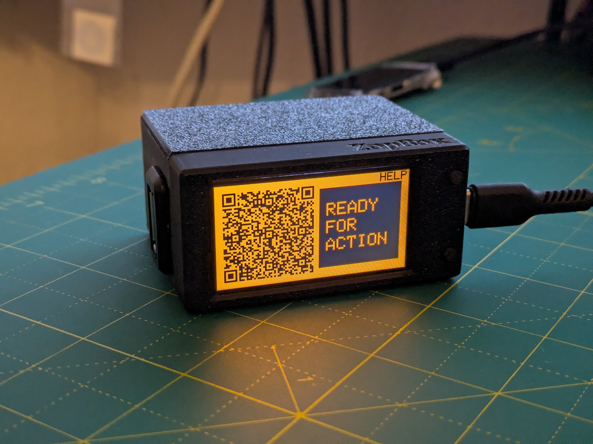

# ZapBox White Paper

**Bitcoin Lightning Network-gesteuerte IoT-Gerätesteuerung**

Version wp930750 | 03. Januar 2026  
🌐 Website: [zapbox.space](https://zapbox.space/) | 💻 GitHub: [AxelHamburch/ZapBox](https://github.com/AxelHamburch/ZapBox)

---

## Abstract

ZapBox ist eine Open-Source-Hardware- und Softwarelösung, die es ermöglicht, physische Geräte über Bitcoin Lightning Zahlungen zu steuern. Durch die Kombination eines ESP32-Mikrocontrollers mit einem Display, Relais und einer WebSocket-basierten Backend-Infrastruktur schafft ZapBox eine Brücke zwischen Bitcoin-Zahlungen und realer IoT-Gerätesteuerung. Dieses White Paper beschreibt die technische Architektur, Implementierungsdetails, Anwendungsfälle und die Vision hinter dem Projekt.

<p align="center">
  
</p>

<p align="center">
  <i>ZapBox Prototyp #001</i>
</p>

---

## Inhaltsverzeichnis

1. [Einleitung](#1-einleitung)
2. [Problemstellung](#2-problemstellung)
3. [Technische Architektur](#3-technische-architektur)
4. [Hardware-Spezifikationen](#4-hardware-spezifikationen)
5. [Backend-Infrastruktur](#5-backend-infrastruktur)
6. [Zahlungsablauf](#6-zahlungsablauf)
7. [Installation und Konfiguration](#7-installation-und-konfiguration)
8. [Betriebsmodi](#8-betriebsmodi)
9. [Sicherheit und Zuverlässigkeit](#9-sicherheit-und-zuverlässigkeit)
10. [Anwendungsfälle](#10-anwendungsfälle)
11. [Open-Source-Ökosystem](#11-open-source-ökosystem)
12. [Roadmap und Zukunftsperspektiven](#12-roadmap-und-zukunftsperspektiven)
13. [Fazit](#13-fazit)
14. [Referenzen](#14-referenzen)

**Anhänge**
- [Anhang A: Technisches Glossar](#anhang-a-technische-glossar)
- [Anhang B: Versionierung](#anhang-b-versionierung)

---

## 1. Einleitung

Die Digitalisierung von Zahlungsprozessen hat in den letzten Jahren erhebliche Fortschritte gemacht. Das Bitcoin Lightning Network bietet als Layer-2-Lösung auf der Bitcoin-Blockchain die Möglichkeit, nahezu kostenfrei und in Echtzeit Mikrotransaktionen durchzuführen. ZapBox nutzt diese Technologie, um eine Schnittstelle zwischen digitalen Zahlungen und physischer Gerätesteuerung zu schaffen.

### Vision

**"Wir möchten die Bitcoin-Lightning-Technologie ⚡ für alle zugänglich machen – weltweit. 🌍"**

ZapBox senkt die Einstiegshürden für die Nutzung von Bitcoin Lightning im Internet of Things (IoT) und ermöglicht es jedem – vom Hobbybastler bis zum professionellen Anwender – eigene Lightning-gesteuerte Anwendungen zu realisieren.

---

## 2. Problemstellung

Trotz des enormen Potenzials des Lightning Networks existieren mehrere Barrieren für dessen breite Adoption im IoT-Bereich:

- **Technische Komplexität**: Die Integration von Lightning-Zahlungen in Hardware-Projekte erfordert tiefgreifendes technisches Wissen
- **Fehlende Standardlösungen**: Es gibt wenige fertige Lösungen, die Hardware, Software und Backend integrieren
- **Rasante Entwicklung**: Die Softwareentwicklung ist mittlerweile so schnell, dass heute funktionierende Lösungen schon morgen obsolet sein können
- **Zugänglichkeit**: Nicht-technische Nutzer können die Technologie nicht ohne weiteres nutzen
- **Hardware-Integration**: Die Verbindung zwischen Zahlungseingang und physischer Aktion ist komplex

ZapBox adressiert diese Herausforderungen durch eine vollständig integrierte, benutzerfreundliche Lösung.

---

## 3. Technische Architektur

### 3.1 Systemübersicht

```
┌─────────────────┐
│  Lightning      │
│  Wallet         │
│  (Nutzer)       │
└────────┬────────┘
         │ QR-Code Scan
         │ LNURL
         ▼
┌─────────────────┐
│  LNbits Server  │
│  + BitcoinSwitch│
│  Extension      │
└────────┬────────┘
         │ WebSocket
         ▼
┌─────────────────┐        ┌──────────────┐
│  ZapBox         │───────►│  Relais      │
│  (ESP32)        │        │  Steuerung   │
└─────────────────┘        └──────────────┘
         │                          │
         ▼                          ▼
┌─────────────────┐        ┌──────────────┐
│  Display        │        │  Externes    │
│  (QR-Code)      │        │  Gerät       │
└─────────────────┘        └──────────────┘
```

### 3.2 Komponenten

**Frontend (Hardware)**
- ESP32 Mikrocontroller mit Display (T-Display-S3)
- Relais-Module
- Schiebeschalter für Vorwahlen
- Onboard Taster oder externe (LED-)Taster optional
- Optionale in Planung: NFC-Unterstützung (PN532)

**Frontend (Software)**
- Web Installer
- ZapBox Firmware

**Backend (Software)**
- LNbits Server (Wallet & Account System)
- BitcoinSwitch Extension
- WebSocket-Server (LNbits) für Echtzeitkommunikation 

**Kommunikation**
- WiFi (2.4 GHz)
- WebSocket-Protokoll
- LNURL-Standard

---

## 4. Hardware-Spezifikationen

### 4.1 Kern-Komponenten

**Mikrocontroller: ESP32 / T-Display-S3**
- ESP32-S3R8 Dual-core LX7 microprocessor
- Flash 16 MB / PSRAM 8 MB
- WiFi 802.11 b/g/n
- Geringe Stromaufnahme
- Deep-Sleep-Modus verfügbar

**Display des T-Display-S3**
- 1.9 inch ST7789 LCD Display (Auflösung: 170x320)
- Optional: Kapazitiver Touchscreen (CST816S)
- Hochauflösende QR-Code-Darstellung
- Konfigurierbare Farbschemata

**Relais-Modul**
- 5V Relais / High-Level-Trigger
- Schaltspannung: bis 250V AC / 30V DC
- Schaltstrom: bis 10A (bis 30A bei Hochleistungsrelais)
- Galvanische Trennung

### 4.2 Physisches Design

Die Hardware ist in drei Hauptvarianten verfügbar, weiter sollen folgen.

- **ZapBox Compact**: Einzelrelais, kompakte Bauweise
- **ZapBox Duo**: Zwei Relais, davon ein Leistungsrelais mit externen Klemmen
- **ZapBox Quattro**: Vier Relais mit externen Anschlussklemmen für professionelle Anwendungen
- **ZapBox Mini**: In Planung.. So klein wie es nur geht

Alle Varianten verfügen über:
- 3D-druckbare Gehäuse (FreeCAD-Dateien verfügbar)
- Elektrische Konstruktionsunterlagen (E-Layout)
- Vereinfachte Stückliste im E-Layout

Und sind kompatibel mit der ZapBox Firmware des Web Installer.

---

## 5. Backend-Infrastruktur

### 5.1 LNbits Server

LNbits ist ein Open-Source Lightning Network Wallet und Account System. Es bietet:

- Multi-User-Wallet-Verwaltung
- Erweiterbare Plugin-Architektur
- REST API
- WebSocket-Support
- Lightning Node Abstraktion

### 5.2 BitcoinSwitch Extension

Die BitcoinSwitch Extension erweitert LNbits um IoT-Steuerungsfunktionalitäten:

- **Device Management**: Verwaltung mehrerer ZapBox-Geräte
- **Invoice Generation**: Automatische Rechnungserstellung
- **WebSocket Bridge**: Echtzeitkommunikation mit Geräten
- **Event Tracking**: Protokollierung aller Schaltvorgänge
- **Multi-Channel Support**: Verwaltung mehrerer Ausgänge pro Gerät

### 5.3 Device String

Jede ZapBox wird durch einen eindeutigen "Device String" identifiziert, der:
- Die Verbindung zum LNbits-Server authentifiziert
- Das spezifische Gerät identifiziert
- Den zu steuernden Ausgang spezifiziert
- In der Firmware konfiguriert wird

---

## 6. Zahlungsablauf

### 6.1 LNURL-Protokoll

Der auf dem Display angezeigte QR-Code verwendet das LNURL-Protokoll (Lightning URL), einen Standard für Lightning Network Interaktionen. Der QR-Code enthält:

1. Server-URL des LNbits-Backends
2. Device-Identifikation
3. Kanal/Ausgangs-Spezifikation

### 6.2 Transaktionsablauf

```
1. ZapBox zeigt QR-Code (LNURL)
   └─> Enthält: Server-URL + Device-ID + Channel

2. Nutzer scannt QR-Code mit Lightning Wallet
   └─> Wallet kontaktiert LNbits Server

3. LNbits prüft WebSocket-Verbindung zur ZapBox
   └─> Bestätigt Geräteverfügbarkeit

4. LNbits generiert Invoice
   └─> Sendet an Wallet mit Betrag & Beschreibung

5. Nutzer bestätigt Zahlung im Wallet
   └─> Lightning-Zahlung wird ausgeführt

6. LNbits bestätigt Zahlungseingang
   └─> Sendet Event über WebSocket an ZapBox

7. ZapBox empfängt Event
   └─> Schaltet Relais für definierte Dauer

8. Relais öffnet/schließt Stromkreis
   └─> Externes Gerät wird aktiviert
```

### 6.3 Timing und Performance

- **Zahlungsbestätigung**: ~2-15 Sekunde (Lightning)
- **Event-Übertragung**: < 500ms (WebSocket)
- **Relais-Reaktion**: < 50ms
- **Gesamtdauer (Scan bis Schaltung)**: ~2-20 Sekunden

---

## 7. Installation und Konfiguration

### 7.1 Web Installer

ZapBox verwendet einen browserbasierten Installer: **https://installer.zapbox.space/**

Vorteile:
- Keine Software-Installation notwendig
- Plattformunabhängig (Windows, macOS, Linux)
- Nutzt Web Serial API
- Visuelles Feedback während des Flash-Vorgangs
- Log Terminal zur Statusanzeige

Hinweis: Chromium-Browser erforderlich, wie z.B. Google Chrome, Microsoft Edge, Opera, Vivaldi und Brave, aber auch spezialisierte wie Ungoogled Chromium, Samsung Internet.

### 7.2 Installationsprozess

**Vorbereitung: Anlegen eines LNbits Account**
1. Erstelle einen Account bei einem LNbits-Server
2. Aktiviere unter "Manage > Extensions > Bitcoin Switch" die Erweiterung
3. Gehe zu "Extensions > Bitcoin Switch" und erstelle einen „NEW BITCOINSWITCH" mit GPIO-Pin 12 und deinen persönlichen Einstellungen
4. Du findest anschließend den "Device string" als kleines Dreieck mit einem Zahnrad-Symbol

**Schritt 1: Firmware-Flash**
1. ZapBox via USB verbinden (ESP32-Port!)
2. Web Installer öffnen
3. Firmware-Version auswählen
4. "Flash" Button klicken
5. Kommunikationsschnittstelle im Pop-Up-Fenster auswählen und verbinden
6. Anweisungen folgen, bestätigen und Flashvorgang abwarten
7. Danach das Fenster schließen

**Schritt 2: Konfiguration**
1. Die ZapBox starten nach dem ersten Flashen automatisch im Modus "CONF"
2. Im Web Installer unter Punkt 3 "Connect" wählen
3. Kommunikationsschnittstelle im Pop-Up-Fenster auswählen und verbinden
4. Die drei Pflichtparameter eingeben:
- **SSID**: WiFi-Netzwerkname
- **Password**: WiFi-Passwort
- **Device String**: Von LNbits BitcoinSwitch Extension
5. Einmal den Button "Write Config" und danach den Button "Restart" drücken
6. ZapBox startet neu und ist nach ein paar Sekunden bereit. 🎉

Optionale Parameter:
- **Display Orientation**: 0°, 90°, 180°, 270°
- **Color Scheme**: Hintergrund- und Textfarben
- **QR-Code Format**: LNURL als bech32 oder LUD17
- **Screensaver**: Nach Timeout, durch Deaktivierung der Hintergrundbeleuchtung
- **Deep Sleep**: Maximaler Energiesparmodus, für Batteriebetrieb
- **Spezielle Modi**: Special, Multi-Channel, BTC-Ticker, Threshold

---

## 8. Betriebsmodi / Einstellungen

Die ZapBox kann individuell angepasst werden, abhängig von der verwendeten Version - Compact, Duo oder Quattro - über den Web Installer und der Parametrierung im LNbits Wallet. 

Standardmäßig ist das die Compact Version mit einem Relais. In LNbits wird dafür der GPIO Pin 12 festgelegt. Hier muss auch die Währung, der Betrag, die Schaltdauer und der neben dem QR-Code angezeigte Text (Feld: Label) angegeben werden.

Die Betriebsmodi können über die Web Installer Seite eingestellt werden, wenn die ZapBox per USB (am ESP32) mit dem Computer verbunden ist und den Modus "CONF" anzeigt. Folgende Modi sind einstellbar:

- **Special Mode**: Trigger Signal als Blink, Pulse, Strobo, Custom
- **Multi-Channel Mode**: Single, Duo, Quattro
- **BTC-Ticker Mode**: Zeigt optional einen BTC-Ticker mit Blockzeit. Fiatwährung frei wählbar.
- **Threshold Mode**: Schalten bei erreichen eines Schwellwerts -> Für z.B. Lightning Adressen oder Nostr Zaps

---

## 9. Sicherheit und Zuverlässigkeit

### 9.1 Sicherheitsaspekte

**Netzwerksicherheit**
- TLS/SSL-verschlüsselte WebSocket-Verbindung
- WPA2-geschütztes WiFi
- Keine privaten Schlüssel auf dem Gerät
- Device String als einzige Authentifizierung

**Zahlungssicherheit**
- Lightning Network native Sicherheit
- Atomare Transaktionen
- Keine Rückbuchungen
- Invoice-basiertes System

### 9.2 Zuverlässigkeit

**Fehlerbehandlung**
- Automatische WiFi-Reconnection
- WebSocket-Reconnection mit Backoff
- Watchdog-Timer
- Fehler-Logging auf Display

**Monitoring**
- Verbindungsstatus auf Display
- Fehlerstatus wird direkt angezeigt
- Optional: Remote-Monitoring über LNbits

**Wartung**
- Einfache Updates
- Diagnose-Modus

---

## 10. Anwendungsfälle

### 10.1 Kommerzielle Anwendungen

**Verkaufsautomaten**
- Getränkeautomaten
- Snackautomaten
- Waschmaschinen/Trockner in Waschsalons
- Schließfächer

**Zugangskontrollen**
- Türöffner
- Parkplatzschranken
- Ladestationen (E-Bike, E-Scooter)
- Co-Working-Spaces

**Dienstleistungen**
- Luftpumpen an Tankstellen
- Staubsauger an Waschplätzen
- Massagesessel
- Duschen (Campingplätze, Strandbäder)

### 10.2 Bildung und Demonstration

**Workshops**
- Bitcoin-Lightning-Schulungen
- IoT-Entwicklung mit Micropayments
- Maker-Spaces und Hackerspaces

**Ausstellungen**
- Hands-on Lightning-Demonstrationen
- Bitcoin-Konferenzen
- Tech-Messen

### 10.3 Private Nutzung

**Smart Home**
- Lichtsteuerung (Gamification)
- Garagentoröffner für Gäste
- Heimautomation mit Bitcoin-Trigger

**Spiele und Challenges**
- Escape-Room-Rätsel
- Bitcoin-Trivia-Automaten
- Belohnungssysteme

### 10.4 Soziale Projekte

**Crowdfunding**
- Threshold-Modus für Gemeinschaftsprojekte
- Öffentliche Kunstinstallationen
- Charity-Events

**Dezentralisierung**
- P2P-Ressourcenteilung ohne zentrale Verwaltung
- Community-betriebene Infrastruktur

---

## 11. Open-Source-Ökosystem

### 11.1 Lizenzierung

Die ZapBox ist vollständig Open Source nach MIT License auf GitHub verfügbar:

**GitHub:** https://github.com/AxelHamburch/ZapBox

**Hardware**
- Elektrische Schaltpläne: [GitHub](https://github.com/AxelHamburch/ZapBox) ../assets/electric
- 3D-Modelle (FreeCAD): [GitHub](https://github.com/AxelHamburch/ZapBox)  ../assets/housing

**Software**
- Firmware: [GitHub](https://github.com/AxelHamburch/ZapBox) ../releases
- Web Installer: [GitHub](https://github.com/AxelHamburch/ZapBox) ../installer

**Dokumentation**
- Dokumentation: [GitHub](https://github.com/AxelHamburch/ZapBox) readme.md
- White Paper: [GitHub](https://github.com/AxelHamburch/ZapBox) ../assets/white-paper
- Website: https://zapbox.space/

### 11.2 Repository-Struktur

**GitHub Repository**: https://github.com/AxelHamburch/ZapBox

```
ZapBox/
├── .vscode/               # VS Code Konfiguration
├── assets/                # Hardware-Designs & Dokumentation
│   ├── electric/         # Elektrische Schaltpläne
│   ├── housing/          # 3D-Modelle für Gehäuse
│   └── white-paper/      # White Paper Dokumente
├── include/               # Header-Dateien
├── installer/             # Web Installer
│   ├── assets/           # Web Installer Assets
│   ├── firmware/         # Firmware-Versionen für Web Installer
│   └── index.html        # Web Installer Hauptdatei
├── lib/                   # Bibliotheken und Dependencies
│   └── TFT_eSPI_Setup/   # Display-Konfiguration
├── src/                   # Firmware-Quellcode
│   ├── main.cpp          # Hauptprogramm
│   ├── Display.cpp/h     # Display-Steuerung
│   ├── Network.cpp/h     # Netzwerk & WebSocket
│   ├── Payment.cpp/h     # Zahlungslogik
│   ├── UI.cpp/h          # Benutzeroberfläche
│   └── ...               # Weitere Module
├── FIRMWARE.md            # Firmware-Dokumentation
├── LICENSE                # MIT Lizenz
├── platformio.ini         # PlatformIO Konfiguration
└── README.md              # Projekt-Dokumentation
```

### 11.3 Verwendete Open-Source-Projekte

**Backend**:
- **LNbits** (MIT): https://github.com/lnbits/lnbits
- **BitcoinSwitch Extension** (MIT): https://github.com/lnbits/bitcoinswitch_extension

**Firmware-Bibliotheken**:
- ESP32 Arduino Core
- TFT_eSPI (Display)
- ArduinoJson
- WebSocketsClient
- WiFiManager

### 11.4 Community-Beiträge

Das Projekt lebt von Community-Beiträgen:
- Bug Reports und Feature Requests über GitHub Issues
- Pull Requests für Verbesserungen
- Hardware-Varianten und Anpassungen
- Übersetzungen
- Dokumentation

---

## 12. Roadmap und Zukunftsperspektiven

### 12.1 Kurz bis mittelfristige Vision

**Software / Firmware**
- NFC-Unterstützung
- OTA-Update-Funktionalität
- Monitoring-Dashboard
- Weitere Features..

**Hardware**
- Alle drei Versionen stabil ausrollen und verfügbar machen
- ZapBox Mini und weitere mögliche Kombinationen prüfen

**Website**
- zapbox.space richtig gut machen

---

## 13. Fazit

ZapBox repräsentiert einen bedeutenden Schritt in der Verbindung von Bitcoin Lightning Network und dem Internet of Things. Durch die Kombination von benutzerfreundlicher Hardware, robuster Software und einem vollständig Open-Source-Ansatz macht das Projekt Lightning-Zahlungen für physische Anwendungen zugänglich.

### Kernvorteile

1. **Zugänglichkeit**: Senkt technische Hürden drastisch
2. **Dezentralisierung**: Keine zentralen Intermediäre notwendig
3. **Kosten**: Mikrotransaktionen ohne signifikante Gebühren
4. **Geschwindigkeit**: Echtzeit-Zahlungen und -Reaktionen
5. **Open Source**: Vollständige Transparenz und Anpassbarkeit
6. **Skalierbarkeit**: Von Einzelgeräten bis zu großen Installationen

### Bedeutung für das Lightning-Ökosystem

ZapBox demonstriert das Potenzial von Lightning über reine Peer-to-Peer-Zahlungen hinaus. Die Ermöglichung von Machine-to-Machine-Payments und IoT-Integration öffnet neue Anwendungsfelder:

- **Circular Economy**: Bitcoin als natives Zahlungsmittel in automatisierten Systemen
- **Programmable Money**: Zahlungen, die automatisch Aktionen auslösen
- **Micropayment Infrastructure**: Grundlage für pay-per-use Geschäftsmodelle

### Aufruf zur Beteiligung

Das Projekt lädt jeden ein, Teil der Entwicklung zu werden:
- **Entwickler**: Tragen Sie zur Firmware und Software bei
- **Hardware-Designer**: Entwickeln Sie neue Varianten und Gehäuse
- **Anwender**: Teilen Sie Ihre Use Cases und Feedback
- **Unternehmen**: Integrieren Sie ZapBox in Ihre Produkte

**"Jeder soll die ZapBox selbst bauen können. Aber viele werden das gar nicht können oder wollen. Wir möchten die Bitcoin-Lightning-Technologie ⚡ für alle zugänglich machen – weltweit. 🌍"**

---

## 14. Referenzen

### Technische Spezifikationen

- **Lightning Network**: https://lightning.network/
- **LNURL Protocol**: https://github.com/lnurl/luds
- **T-Display-S3 LILYGO**: https://lilygo.cc/products/t-display-s3

### Open-Source-Projekte

- **ZapBox GitHub**: https://github.com/AxelHamburch/ZapBox
- **LNbits**: https://github.com/lnbits/lnbits
- **BitcoinSwitch Extension**: https://github.com/lnbits/bitcoinswitch_extension
- **T-Display-S3 Github**: https://github.com/Xinyuan-LilyGO/T-Display-S3

### Weiterführende Informationen

- **ZapBox Website**: https://zapbox.space
- **ZapBox GitHub**: https://github.com/AxelHamburch/ZapBox
- **Web Installer**: https://installer.zapbox.space
- **Bitcoin Switch (Ben Arc)**: https://github.com/lnbits/bitcoinSwitch

### Kontakt

- **Community Gruppe**: https://t.me/ZapBoxDotSpace
- **Repository Issues**: https://github.com/AxelHamburch/ZapBox/issues
- **Email**: info@zapbox.space

---

## Anhang A: Technische Glossar

- **ESP32**: Mikrocontroller von Espressif mit WiFi und Bluetooth
- **Lightning Network**: Layer-2-Protokoll für schnelle Bitcoin-Transaktionen
- **LNURL**: Lightning URL Protocol für vereinfachte Interaktionen
- **Invoice**: Lightning-Rechnung für eine Zahlung
- **WebSocket**: Bidirektionales Kommunikationsprotokoll
- **Relais**: Elektromechanischer Schalter
- **OTA**: Over-The-Air (drahtlose Firmware-Updates)
- **FOSS**: Free and Open Source Software

---

## Anhang B: Versionierung

**Firmware-Versionen**:
- v9.x.x: Aktuelle Hauptversion
- Semantische Versionierung (MAJOR.MINOR.PATCH)
- Release Notes im GitHub Repository

**Hardware-Revisionen**:
- Elektrische Schemata: eXXXXXX-compact
- Gehäuse: bXXXXXX-compact
- Vollständige History in Git

---

*Dieses Dokument wurde am 3. Januar 2026 erstellt und wird regelmäßig aktualisiert. Die neueste Version ist stets im GitHub-Repository verfügbar.*

---

**ZapBox - Open Source Bitcoin Lightning IoT**

⚡ Powered by the Lightning Network | 🌍 Available Worldwide | 🔓 Fully Open Source
